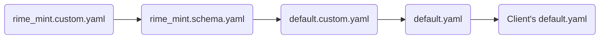

# Configuration Overrides and Customization
Customization is easy to understand. The Mint Input Method is based on the Rime Input Method framework, which is essentially a set of Rime Input Method configurations. Different Rime clients have a large number of personalization configurations. Although the Mint Input Method has already made a lot of settings, there are still many configurations that have not been activated; users can configure them according to their preferences.

As for overrides, it means that the Mint Input Method has already configured the Rime Input Method client, but it may not meet your preferences, so you can override it.

## Rime's Personalized Configuration Files
Rime's configuration is generally divided into two types:
- Input method application configuration: This is generally used to set the appearance of the client, and each client may be different. For example: on macOS (Squirrel) and Windows (Weasel), you can set the appearance of the input method and vertical input, etc.
- Input method scheme configuration: This is used to set the internal configuration of the input method scheme; for example: setting the form of the period when inputting in half-width, input method page turning shortcut keys, etc.

Generally speaking, if you want to customize the display of the appearance, then set the "input method application configuration", on macOS it is `squirrel.yaml` and `squirrel.custom.yaml`; on Windows it is `weasel.yaml` and `weasel.custom.yaml`.

If you want to override the content and method of input, then it is to set the "input method scheme configuration", which is divided into "global input settings (default)" and "input scheme settings (scheme)"; similarly, as a setting, there are also `custom files with custom` and `schema files without custom`.

> Why are there both `with custom` and `without custom`?
>> In fact, **those without custom are configuration customizations, used to implement configurations**; **those with custom are configuration overrides, used to override some configurations without custom; other contents inherit configurations without custom**.

## Input Method Application Configuration
First, let's look at the application configuration. This makes it easy for us to modify the appearance of the input method.

Taking the Mint Input Method as an example, we have already installed the Mint Input Method. If you are on macOS, you can open the `squirrel.yaml` file. The Mint Input Method is already based on the official configuration: [Squirrel source code configuration](https://github.com/rime/squirrel/blob/master/data/squirrel.yaml)

If your project does not have a `squirrel.yaml` file, then it will use the official configuration. Similarly, if you are on Windows and do not have a `weasel.yaml` file, then it will use: [Weasel source code configuration](https://github.com/rime/weasel/blob/master/output/data/weasel.yaml)

Content reference (excerpt from the `squirrel.yaml` file for reference):

```yaml
style:
  # 选择皮肤，亮色与暗色主题
  color_scheme: mint_light_blue
  color_scheme_dark: mint_dark_blue
  
  # 预设选项。如果皮肤没写，则使用这些属性；如果皮肤写了，使用皮肤的。
  text_orientation: horizontal  # horizontal | vertical
  candidate_list_layout: stacked # stacked | linear  候选项排列方向（如果你想调整为横屏，可以调整这个）
  
  # 内嵌预编辑
  inline_preedit: true
  # 选中框 圆角半径
  hilited_corner_radius: 0
  # 窗口边界高度，大于圆角半径才生效
  border_height: 0
  # 窗口边界宽度，大于圆角半径才生效
  border_width: 0
  # 外边框 圆角半径
  corner_radius: 10
  # 色彩空间： srgb | display_p3
  color_space: srgb
  line_spacing: 5
  spacing: 10
  #candidate_format: '%c. %@'
  #base_offset: 6
  # 全局字体及大小
  font_face: "PingFang SC"
  font_point: 16
  # 序号字体及大小
  label_font_face: "PingFang SC"
  label_font_point: 16
  # 注字体及大小
  comment_font_face: "PingFang SC"
  comment_font_point: 14
```
The internal comments are comprehensive, and you can refer to them if you're interested.

You can directly modify this file and then redeploy. You can also modify the `custom` file (if it doesn't exist, you can create it in the same directory without `custom`).

If you want to modify the `custom` file, please note:
- You need to use `patch` to describe at the beginning;
- When overwriting some content, you need to use `""` to point to the specific content.

For example: If you want to change the layout of Squirrel to horizontal, you can write `squirrel.custom.yaml` like this:
```yaml
patch:
  "style/horizontal": false
```
Counterexample:
```yaml
patch:
  style:
    # This will clear the content inside style, leaving only one horizontal configuration
    horizontal: false
```

## Input Method Scheme Configuration

Next, let's look at the "Input Method Scheme Configuration". The global configuration of the scheme is `default.yaml` and `default.custom.yaml`; for the local part, taking the Mint Input Method as an example:
- `rime_mint.schema.yaml` is a local configuration. `rime_mint.schema.yaml` can override the configuration of `default.yaml`.
- If you want to modify the full Pinyin configuration within the Mint Input Method, it is recommended to use the `rime_mint.custom.yaml` file for overriding (Note: this is for the full Pinyin configuration within the Mint Input Method; if you are using the Double Fly Pinyin within the Mint Input Method, then use the `double_pinyin_flypy.custom.yaml` file. For other configurations within the Mint Input Method, follow this analogy).

So, the priority is:


Currently, the Mint Input Method has implemented the `default.yaml` configuration. When using the Mint configuration, it will automatically override the `default.yaml` that comes with the Rime client (Squirrel, Weasel, etc.).

So:
- If you want to customize the global style, it is recommended to use the `default.custom.yaml` file to override `default.yaml`;
- If you want to modify the configuration of the Mint Input Method, it is recommended to use the `rime_mint.custom.yaml` file for overriding.

Example: Override the global input scheme configuration and set the candidate to 6:
```yaml
patch:
  "menu/page_size": 6
```

Counterexample:
```yaml
patch:
  menu:
    # This will clear the content inside menu, leaving only one page_size configuration
    page_size: 6
```

Don't worry, there are more examples in this chapter for reference.

## Modifying the Configuration of the Mint Input Method
The Mint Input Method comes with a lot of configurations, but they may not suit your preferences. Therefore, you can override them according to your preferences.

Taking "Mint Pinyin" as an example, how should we enable its fuzzy pinyin?

Its configuration file is `rime_mint.schema.yaml`. Sometimes when I update, I will modify this file. If you want to override the update and do not use Git for management, there may be conflicts.

Therefore, it is recommended to use the `rime_mint.custom.yaml` file for overriding. In this way, even if it is updated, you can directly override the file with the same name without affecting your configuration.

In summary, we can operate as follows:
1. Open or create the `rime_mint.custom.yaml` file;
2. According to the [Fuzzy Pinyin](fuzzyPinyin.html) section later, we know that we need to override the `speller/algebra` module, using `patch` for overriding,

Content of the `rime_mint.custom.yaml` file:
```yaml
# Rime schema
# encoding: utf-8

patch:
  speller/algebra:
    - erase/^xx$/ # 首选保留
    ## 模糊拼音
    - derive/^([zcs])h/$1/ # zh, ch, sh => z, c, s
    - derive/^([zcs])([^h])/$1h$2/ # z, c, s => zh, ch, sh
    - derive/([aei])n$/$1ng/ # en => eng, in => ing
    - derive/([aei])ng$/$1n/ # eng => en, ing => in
    - derive/([iu])an$/$lan/ # ian => iang, uan => uang
    - derive/([iu])ang$/$lan/ # iang => ian, uang => uan
    - derive/([aeiou])ng$/$1gn/        # dagn => dang
    - derive/([dtngkhrzcs])o(u|ng)$/$1o/  # zho => zhong|zhou
    - derive/ong$/on/                  # zhonguo => zhong guo
    - abbrev/^([a-z])[a-z]*$/$1/       # 简拼（首字母）
    - abbrev/^([zcs]h).+$/$1/          # 简拼（zh, ch, sh）
     ### 自动纠错
    # 有些规则对全拼简拼混输有副作用：如「x'ai 喜爱」被纠错为「xia 下」
    # zh、ch、sh
    - derive/([zcs])h(a|e|i|u|ai|ei|an|en|ou|uo|ua|un|ui|uan|uai|uang|ang|eng|ong)$/h$1$2/  # hzi → zhi
    - derive/([zcs])h([aeiu])$/$1$2h/  # zih → zhi
    # ai
    - derive/^([wghk])ai$/$1ia/  # wia → wai
    # ia
    - derive/([qjx])ia$/$1ai/  # qai → qia
    # ei
    - derive/([wtfghkz])ei$/$1ie/
    # ie
    - derive/([jqx])ie$/$1ei/
    # ao
    - derive/([rtypsdghklzcbnm])ao$/$1oa/
    # ou
    - derive/([ypfm])ou$/$1uo/
    # uo（无）
    # an
    - derive/([wrtypsdfghklzcbnm])an$/$1na/
    # en
    - derive/([wrpsdfghklzcbnm])en$/$1ne/
    # ang
    - derive/([wrtypsdfghklzcbnm])ang$/$1nag/
    - derive/([wrtypsdfghklzcbnm])ang$/$1agn/
    # eng
    - derive/([wrtpsdfghklzcbnm])eng$/$1neg/
    - derive/([wrtpsdfghklzcbnm])eng$/$1egn/
    # ing
    - derive/([qtypdjlxbnm])ing$/$1nig/
    - derive/([qtypdjlxbnm])ing$/$1ign/
    # ong
    - derive/([rtysdghklzcn])ong$/$1nog/
    - derive/([rtysdghklzcn])ong$/$1ogn/
    # iao
    - derive/([qtpdjlxbnm])iao$/$1ioa/
    - derive/([qtpdjlxbnm])iao$/$1oia/
    # ui
    - derive/([rtsghkzc])ui$/$1iu/
    # iu
    - derive/([qjlxnm])iu$/$1ui/
    # ian
    - derive/([qtpdjlxbnm])ian$/$1ain/
    # - derive/([qtpdjlxbnm])ian$/$1ina/ # 和「李娜、蒂娜、缉拿」等常用词有冲突
    # in
    - derive/([qypjlxbnm])in$/$1ni/
    # iang
    - derive/([qjlxn])iang$/$1aing/
    - derive/([qjlxn])iang$/$1inag/
    # ua
    - derive/([g|k|h|zh|sh])ua$/$1au/
    # uai
    - derive/([g|h|k|zh|ch|sh])uai$/$1aui/
    - derive/([g|h|k|zh|ch|sh])uai$/$1uia/
    # uan
    - derive/([qrtysdghjklzxcn])uan$/$1aun/
    # - derive/([qrtysdghjklzxcn])uan$/$1una/ # 和「去哪、露娜」等常用词有冲突
    # un
    - derive/([qrtysdghjklzxc])un$/$1nu/
    # ue
    - derive/([nlyjqx])ue$/$1eu/
    # uang
    - derive/([g|h|k|zh|ch|sh])uang$/$1aung/
    - derive/([g|h|k|zh|ch|sh])uang$/$1uagn/
    - derive/([g|h|k|zh|ch|sh])uang$/$1unag/
    - derive/([g|h|k|zh|ch|sh])uang$/$1augn/
    # iong
    - derive/([jqx])iong$/$1inog/
    - derive/([jqx])iong$/$1oing/
    - derive/([jqx])iong$/$1iogn/
    - derive/([jqx])iong$/$1oign/
    # 其他
    - derive/([rtsdghkzc])o(u|ng)$/$1o/ # do → dou|dong
    - derive/ong$/on/ # lon → long
    - derive/([tl])eng$/$1en/ # ten → teng
    - derive/([qwrtypsdfghjklzxcbnm])([aeio])ng$/$1ng/ # lng → lang、leng、ling、long
```

Comparing `rime_mint.custom.yaml` and `rime_mint.schema.yaml`：


## Example: Customizing Skins
If you want to customize the skin, you first need to identify your current Rime client. Different clients use different skins, so you need to modify according to your client.

The Oh-my-rime (input scheme) integrates two sets of skins that can be used within Squirrel and Weasel: the Duck Series and the Green Series.

For the Squirrel client, if you want to change the Duck Series skin to the Green Series, patch as follows in the `squirrel.custom.yaml` file:
```yaml
# Only one patch node can be in a file
patch:
  # Override the light mode skin to mint_light_green (Jade Green)
  "style/color_scheme": mint_light_green
  # Override the dark mode skin to mint_dark_green (Emerald Green)
  "style/color_scheme_dark": mint_dark_green
```
Afterward, redeploy.

For the Weasel client, if you want to change the Green Series skin to the Duck Series, it is also done in the same way, except the file name is `weasel.custom.yaml`.

In fact, the properties that can be patched depend on the file without `custom`.

So, don't assume that Squirrel and Weasel can modify the same configurations. To see which appearance configurations can be modified, it is recommended to check the `squirrel.yaml` and `weasel.yaml` files, and then modify according to your needs.

## Example: Horizontal Input Method
If you want to change the layout of the input method to horizontal on macOS, you can do the following:
1. Open or create the `squirrel.custom.yaml` file;
2. Use `patch` to override, change `candidate_list_layout` to `linear`;

Possible content:
```yaml
patch:
  # stacked | linear | tabled candidate list layout direction (if you want horizontal, set to linear)
  style/candidate_list_layout: linear
```

::: warning Warning
If your input method skin has `candidate_list_layout: stacked` set, due to the reason that local configuration is greater than global configuration, this setting may be invalid.

At the same time, currently, the configuration priority of `candidate_list_layout` is higher than `horizontal: true`. However, if the `candidate_list_layout` setting is invalid, you can also try `horizontal: true`.
:::

## Example: Customizing the Input Dictionary
If you want to customize the dictionary, you can do so as follows, taking the "Mint Pinyin - Full Pinyin Input" in the Mint Input Method as an example:
1. Open or create the `rime_mint.custom.yaml` file;
2. Use `patch` to override, change `translator/dictionary` to your custom dictionary;

Possible content:
```yaml
patch:
  # Set the dictionary of "Mint Pinyin - Full Pinyin Input", use the rime_mint.custom.dict.yaml file
  translator/dictionary: rime_mint.custom
```

At the same time, you can see that we are locating the `rime_mint.custom.dict.yaml` file here, so we can create this file and then write our dictionary into this file. It is recommended to copy a set of the dictionary that comes with Mint and then modify it:
```yaml
---
name: rime_mint.custom                  # Note that the name is consistent with the file name
version: "2024.02.11"
sort: by_weight
# This is the dictionary used by the input method, which is where to supplement the extended dictionary
# The Mist Pinyin dictionary, automatically updated by Github Robot
import_tables:
  - dicts/custom_simple          # Custom
  - dicts/rime_ice.8105          # Mist Pinyin Common Character Set
  - dicts/rime_ice.41448         # Mist Pinyin Complete Character Set
  - dicts/rime_ice.base          # Mist Pinyin Basic Dictionary
  - dicts/rime_ice.ext           # Mist Pinyin Extended Dictionary
  - dicts/other_kaomoji          # Facial expressions (call out by pressing `vv`)
  - dicts/other_emoji            # Emoji (just as a supplement, usually effective by OpenCC)
  - dicts/rime_ice.others        # Mist Pinyin others dictionary (for automatic error correction)
  - dicts/yourCustomDict         # Your custom dictionary
...
```