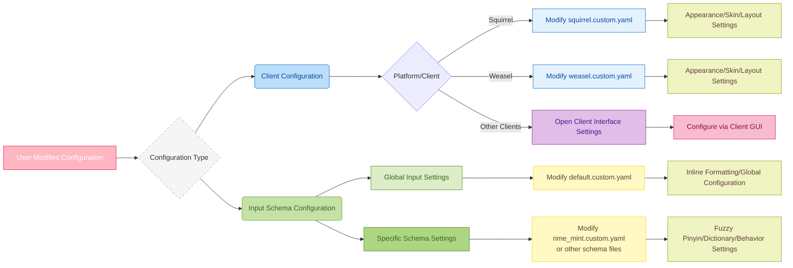

# Configuration Overrides and Customization
Customization is easy to understand. The Mint Input Method is based on the Rime Input Method framework, which is essentially a set of Rime Input Method configurations. Different Rime clients have a large number of personalization configurations. 

Although the Mint Input Method has already made a lot of settings, there are still many configurations that have not been activated; users can configure them according to their preferences.

As for overrides, it means that the Mint Input Method has already configured the Rime Input Method client, but it may not meet your preferences, so you can override it.

## Configuration Override Quick Reference

If you arrived here from search or a knowledge-base result, start with this table. Rime custom files all use `patch:`, but you first need to decide whether you are changing "client appearance" or "input schema behavior".

| What You Want to Change | Recommended File | Common Patch Paths or Keywords |
|------|------|------|
| Squirrel appearance, macOS skin, candidate layout | `squirrel.custom.yaml` | `style/candidate_list_layout`, `style/horizontal`, `style/color_scheme`, `style/color_scheme_dark`, `font_face`, `font_point` |
| Weasel appearance, Windows skin, horizontal candidate list | `weasel.custom.yaml` | `style/candidate_list_layout`, `style/horizontal`, `style/color_scheme`, `style/color_scheme_dark` |
| Global schema list, default active schemas | `default.custom.yaml` | `schema_list` |
| Mint full-pinyin schema behavior | `rime_mint.custom.yaml` | `speller/algebra`, `translator/dictionary`, `recognizer/patterns`, `engine/filters`, `engine/translators` |
| Xiaohe Double Pinyin schema behavior | `double_pinyin_flypy.custom.yaml` | `speller/algebra`, `aux_code/trigger_word`, `translator/preedit_format`, `menu/page_size` |
| Mint full pinyin + Xiaohe mixed input | `rime_mint_flypy.custom.yaml` | `speller/algebra`, `translator/preedit_format`, `menu/page_size` |
| Candidate count, paging keys, Emoji shortcut | The corresponding schema `.custom.yaml` | `menu/page_size`, `key_binder/bindings`, `key_binder/bindings/@next` |
| Fuzzy pinyin, abbreviation, typo correction rules | The corresponding schema `.custom.yaml` | `speller/algebra`, `speller/algebra/+` |
| Manual pinyin segmentation and delimiters | The corresponding schema `.custom.yaml` | `speller/delimiter` |
| Custom dictionary or extended dictionary | The corresponding schema `.custom.yaml` + `.dict.yaml` | `translator/dictionary`, `import_tables` |
| Maximum pinyin string length and truncation | The corresponding schema `.custom.yaml` | `codeLengthLimit_processor` |
| Symbol input, half-width punctuation, custom `/` symbols | The corresponding schema `.custom.yaml` | `punctuator/symbols`, `punctuator/half_shape`, `recognizer/patterns/punct` |

### Patch Syntax Quick Reference

A `custom.yaml` file usually has only one top-level `patch:`. If you need to change multiple settings, put all of them under the same `patch:` instead of writing multiple `patch:` sections.

| Goal | Syntax | Description |
|------|------|-------------|
| Override one value | `"menu/page_size": 9` | Replace the value at the target path |
| Override an entire list | `speller/algebra: [...]` | Replace the original list with your list |
| Append to a list | `"speller/algebra/+": [...]` | Keep the original list and append new rules |
| Append one list item | `"key_binder/bindings/@next": {...}` | Commonly used to add a key binding |
| Modify the last list item | `"switches/@last": {...}` | Commonly used when adding or adjusting the last switch |
| Modify a key containing `/` | `"punctuator/symbols//email": [...]` | Use a double slash when the key name itself contains `/` |

Using quoted path syntax is recommended, for example `"style/candidate_list_layout": linear`. Avoid casually writing a nested map; writing only `style:` with one child may clear other settings under `style`.


```mermaid
graph LR
    U[User Modifies Configuration]:::custom --> T{Configuration Type}:::decision
    T --> C1(Client Configuration):::client
    T --> C2(Input Schema Configuration):::schema
    
    C1 --> P{Platform/Client}
    P -->|Squirrel| S1[Modify squirrel.custom.yaml]:::clientFile
    P -->|Weasel| S2[Modify weasel.custom.yaml]:::clientFile
    P -->|Other Clients| S3[Open Client Interface Settings]:::otherClient
    
    S1 --> SA[Appearance/Skin/Layout Settings]:::clientAttr
    S2 --> SB[Appearance/Skin/Layout Settings]:::clientAttr
    S3 --> SC[Configure via Client GUI]:::otherAttr
    
    C2 --> G[Global Input Settings]:::global
    C2 --> S[Specific Schema Settings]:::specific
    
    G --> D[Modify default.custom.yaml]:::globalFile
    D --> GA[Inline Formatting/Global Configuration]:::globalAttr
    
    S --> R[Modify rime_mint.custom.yaml<br>or other schema files]:::specificFile
    R --> SA1[Fuzzy Pinyin/Dictionary/Behavior Settings]:::specificAttr

    classDef custom fill:#ffb6c1,stroke:#e91e63,color:#ffffff;
    classDef decision fill:#f5f5f5,stroke:#9e9e9e,color:#333333,stroke-dasharray: 5 5;
    classDef client fill:#bbdefb,stroke:#1565c0,color:#0d47a1;
    classDef clientFile fill:#e3f2fd,stroke:#1976d2,color:#0d47a1;
    classDef otherClient fill:#e1bee7,stroke:#9c27b0,color:#4a148c;
    classDef clientAttr fill:#f0f4c3,stroke:#9e9d24,color:#5d4037;
    classDef otherAttr fill:#f8bbd0,stroke:#e91e63,color:#880e4f;
    classDef schema fill:#c5e1a5,stroke:#689f38,color:#33691e;
    classDef global fill:#dcedc8,stroke:#558b2f,color:#33691e;
    classDef globalFile fill:#fff9c4,stroke:#ffd600,color:#5d4037;
    classDef globalAttr fill:#f0f4c3,stroke:#9e9d24,color:#5d4037;
    classDef specific fill:#aed581,stroke:#558b2f,color:#33691e;
    classDef specificFile fill:#fff9c4,stroke:#ffd600,color:#5d4037;
    classDef specificAttr fill:#f0f4c3,stroke:#9e9d24,color:#5d4037;
```

## Rime's Personalized Configuration Files
Rime's configuration is generally divided into two types:
- Input method application configuration: This is generally used to set the appearance of the client, and each client may be different. For example: on macOS (Squirrel) and Windows (Weasel), you can set the appearance of the input method and vertical input, etc.
- Input method scheme configuration: This is used to set the internal configuration of the input method scheme; for example: setting the form of the period when inputting in half-width, input method page turning shortcut keys, etc.

Generally speaking, if you want to customize the display of the appearance, then set the "input method application configuration", on macOS it is `squirrel.yaml` and `squirrel.custom.yaml`; on Windows it is `weasel.yaml` and `weasel.custom.yaml`.

If you want to override the content and method of input, then it is to set the "input method scheme configuration", which is divided into "global input settings (default)" and "input scheme settings (scheme)"; similarly, as a setting, there are also `custom files with custom` and `schema files without custom`.

> Why are there both `with custom` and `without custom`?
>> In fact, **those without custom are configuration customizations, used to implement configurations**; **those with custom are configuration overrides, used to override some configurations without custom; other contents inherit configurations without custom**.

### Choosing the Right File

When a configuration does not take effect, the most common reason is editing the wrong file. Use these rules:

| File | Scope | Best For |
|------|------|----------|
| `squirrel.custom.yaml` | Squirrel client on macOS | Candidate window appearance, skin, font, horizontal/vertical layout, inline preedit |
| `weasel.custom.yaml` | Weasel client on Windows | Candidate window appearance, skin, font, horizontal/vertical layout |
| `default.custom.yaml` | Rime global defaults | Schema list, default active schemas, global behavior not overridden by a schema |
| `rime_mint.custom.yaml` | Mint full-pinyin schema | Fuzzy pinyin, dictionaries, candidate count, key bindings, Lua settings |
| `double_pinyin_flypy.custom.yaml` | Xiaohe Double Pinyin schema | Auxiliary code, double-pinyin display, candidate count, key bindings |
| `rime_mint_flypy.custom.yaml` | Mint full pinyin and Xiaohe mixed schema | Mixed-input spelling rules, candidate count, key bindings |
| `*.dict.yaml` | Dictionary data | Custom words, word frequency, imported dictionaries |

Useful search phrases can combine filenames and paths directly, such as `weasel.custom.yaml style/horizontal`, `squirrel.custom.yaml candidate_list_layout`, `rime_mint.custom.yaml speller/algebra`, or `double_pinyin_flypy.custom.yaml aux_code/trigger_word`.

## Input Method Application Configuration
First, let's look at the application configuration. This makes it easy for us to modify the appearance of the input method.

Taking the Mint Input Method as an example, we have already installed the Mint Input Method. If you are on macOS, you can open the `squirrel.yaml` file. The Mint Input Method is already based on the official configuration: [Squirrel source code configuration](https://github.com/rime/squirrel/blob/master/data/squirrel.yaml)

If your project does not have a `squirrel.yaml` file, then it will use the official configuration. Similarly, if you are on Windows and do not have a `weasel.yaml` file, then it will use: [Weasel source code configuration](https://github.com/rime/weasel/blob/master/output/data/weasel.yaml)

Content reference (excerpt from the `squirrel.yaml` file for reference):

```yaml
style:
  # 选择皮肤，亮色与暗色主题
  color_scheme: mint_light_blue
  color_scheme_dark: mint_dark_blue
  
  # 预设选项。如果皮肤没写，则使用这些属性；如果皮肤写了，使用皮肤的。
  text_orientation: horizontal  # horizontal | vertical
  candidate_list_layout: stacked # stacked | linear  候选项排列方向（如果你想调整为横屏，可以调整这个）
  
  # 内嵌预编辑
  inline_preedit: true
  # 选中框 圆角半径
  hilited_corner_radius: 0
  # 窗口边界高度，大于圆角半径才生效
  border_height: 0
  # 窗口边界宽度，大于圆角半径才生效
  border_width: 0
  # 外边框 圆角半径
  corner_radius: 10
  # 色彩空间： srgb | display_p3
  color_space: srgb
  line_spacing: 5
  spacing: 10
  #candidate_format: '%c. %@'
  #base_offset: 6
  # 全局字体及大小
  font_face: "PingFang SC"
  font_point: 16
  # 序号字体及大小
  label_font_face: "PingFang SC"
  label_font_point: 16
  # 注字体及大小
  comment_font_face: "PingFang SC"
  comment_font_point: 14
```
The internal comments are comprehensive, and you can refer to them if you're interested.

You can directly modify this file and then redeploy. You can also modify the `custom` file (if it doesn't exist, you can create it in the same directory without `custom`).

If you want to modify the `custom` file, please note:
- You need to use `patch` to describe at the beginning;
- When overwriting some content, you need to use `""` to point to the specific content.

For example: If you want to change the layout of Squirrel to horizontal, you can write `squirrel.custom.yaml` like this:
```yaml
patch:
  "style/candidate_list_layout": linear
```
Counterexample:
```yaml
patch:
  style:
    # This will clear the content inside style, leaving only one horizontal configuration
    horizontal: false
```

## Input Method Scheme Configuration

Next, let's look at the "Input Method Scheme Configuration". The global configuration of the scheme is `default.yaml` and `default.custom.yaml`; for the local part, taking the Mint Input Method as an example:
- `rime_mint.schema.yaml` is a local configuration. `rime_mint.schema.yaml` can override the configuration of `default.yaml`.
- If you want to modify the full Pinyin configuration within the Mint Input Method, it is recommended to use the `rime_mint.custom.yaml` file for overriding (Note: this is for the full Pinyin configuration within the Mint Input Method; if you are using the Double Fly Pinyin within the Mint Input Method, then use the `double_pinyin_flypy.custom.yaml` file. For other configurations within the Mint Input Method, follow this analogy).

So, the priority is:


```mermaid
graph LR
    A(rime_mint.custom.yaml):::custom --> B(rime_mint.schema.yaml):::schema
    B --> C(default.custom.yaml):::defaultCustom
    C --> D(default.yaml):::default
    D --> E(Client's default.yaml):::client

    classDef custom fill:#E0095F,stroke:#e91e63,color:#ffffff;
    classDef schema fill:#c5e1a5,stroke:#689f38,color:#33691e;
    classDef defaultCustom fill:#f0f4c3,stroke:#9e9d24,color:#5d4037;
    classDef default fill:#fff9c4,stroke:#ffd600,color:#5d4037;
    classDef client fill:#f5f5f5,stroke:#bdbdbd,color:#757575;
```

Currently, the Mint Input Method has implemented the `default.yaml` configuration. When using the Mint configuration, it will automatically override the `default.yaml` that comes with the Rime client (Squirrel, Weasel, etc.).

So:
- If you want to customize the global style, it is recommended to use the `default.custom.yaml` file to override `default.yaml`;
- If you want to modify the configuration of the Mint Input Method, it is recommended to use the `rime_mint.custom.yaml` file for overriding.

::: warning Special Note on page_size, key_binder and Similar Configurations
To maintain compatibility with the [Rimetool](https://github.com/yanhuacuo/rimetool) visual configuration tool, Oh My Rime **redundantly includes** `menu` (containing `page_size`) and `key_binder` configurations **within each schema's `.schema.yaml` file**. This means these configuration items have independent definitions in the schema files and **will not be inherited from `default.yaml`**.

Therefore, if you want to modify the candidate count, key bindings, or similar configurations, **do not override them in `default.custom.yaml`. Instead, override them in the corresponding schema's `.custom.yaml` file**. See the section [Example: Overriding Candidate Count and Key Bindings](#example-overriding-candidate-count-and-key-bindings) below for details.
:::

Example: Override the global input scheme configuration and set the candidate to 6:
```yaml
patch:
  "menu/page_size": 6
```

Counterexample:
```yaml
patch:
  menu:
    # This will clear the content inside menu, leaving only one page_size configuration
    page_size: 6
```

Don't worry, there are more examples in this chapter for reference.

## Common Configuration Path Index

These are the configuration paths most often searched by Oh-my-rime and Rime users. In actual use, put the examples under the same `patch:` section in the correct custom file.

### Horizontal or Vertical Candidate Layout

For Squirrel or Weasel horizontal candidate layout, horizontal candidate list, or candidate window direction, try:

```yaml
patch:
  "style/candidate_list_layout": linear  # linear: horizontal; stacked: vertical; tabled: table
```

If `candidate_list_layout` does not work in Weasel, try:

```yaml
patch:
  "style/horizontal": true
```

### Candidate Count

For candidate count, number of candidates per page, or `page_size`, modify the corresponding schema `.custom.yaml`:

```yaml
patch:
  "menu/page_size": 9
```

### Key Bindings and Paging Keys

For shortcuts, paging keys, `key_binder`, or Emoji toggle shortcuts, append a binding in the corresponding schema:

```yaml
patch:
  "key_binder/bindings/@next":
    accept: "Control+Shift+E"
    toggle: emoji_suggestion
    when: always
```

### Fuzzy Pinyin and Correction Rules

For fuzzy pinyin, abbreviation, typo correction, or `speller/algebra`, you can override or append rules. Appending is common:

```yaml
patch:
  "speller/algebra/+":
    - derive/^([zcs])h/$1/
```

If you use a mixed double-pinyin and full-pinyin schema, rule order affects double-pinyin parsing. In that case, you usually need to override the full `speller/algebra` instead of simply appending.

### Custom Dictionary

For custom dictionaries, extended dictionaries, Sogou dictionaries, or `translator/dictionary`, the usual entry point is:

```yaml
patch:
  "translator/dictionary": rime_mint.custom
```

The recommended structure is to use `rime_mint.custom.dict.yaml` as a dictionary entry file. It imports other dictionary files through `import_tables`, while the actual custom words live in files such as `dicts/my_custom_dicts.dict.yaml` or `dicts/custom_simple.dict.yaml`.

### Lua Settings and Input Length

For maximum pinyin string length, long-input truncation, or `codeLengthLimit_processor`, use:

```yaml
patch:
  "codeLengthLimit_processor": 100
```

Other Lua settings follow the same idea, such as the date/time leader key `key_binder/shijian_keys`, select-character keys `key_binder/select_first_character`, or auxiliary-code trigger key `aux_code/trigger_word`.

### Symbols and Half-width Punctuation

For custom symbol input, `/email`, `/phone`, or half-width punctuation mapping, modify:

```yaml
patch:
  "punctuator/symbols//email": [📧, ✉, 📨, 📩]
  "punctuator/half_shape/\\": "/"
```

The double slash in `punctuator/symbols//email` means the key name really contains `/`; it is not a path separator.

### Pinyin Delimiter and Apostrophe

Mint full-pinyin segmentation is controlled by `speller/delimiter` in the schema. The first character in the default value is a space, which is the normal separator between pinyin syllables. The other character is used for manual segmentation when a pinyin string is ambiguous.

To change the manual segmentation key, override it in the corresponding schema `.custom.yaml`. For Mint full-pinyin, use `rime_mint.custom.yaml`:

```yaml
patch:
  "speller/delimiter": " `"
```

In this example, the first character is a space and the second character is a backtick. Note that `speller/delimiter` only controls pinyin segmentation while composing. If pressing apostrophe `'` directly outputs `「」`, that comes from the half-width punctuation mapping, not from the segmentation setting. To make apostrophe output a literal ASCII apostrophe, override:

```yaml
patch:
  "punctuator/half_shape/'": "'"
```

## Modifying the Configuration of the Mint Input Method
The Mint Input Method comes with a lot of configurations, but they may not suit your preferences. Therefore, you can override them according to your preferences.

Taking "Mint Pinyin" as an example, how should we enable its fuzzy pinyin?

Its configuration file is `rime_mint.schema.yaml`. Sometimes when I update, I will modify this file. If you want to override the update and do not use Git for management, there may be conflicts.

Therefore, it is recommended to use the `rime_mint.custom.yaml` file for overriding. In this way, even if it is updated, you can directly override the file with the same name without affecting your configuration.

In summary, we can operate as follows:
1. Open or create the `rime_mint.custom.yaml` file;
2. According to the [Fuzzy Pinyin](fuzzyPinyin.html) section later, we know that we need to override the `speller/algebra` module, using `patch` for overriding,

Content of the `rime_mint.custom.yaml` file:
```yaml
# Rime schema
# encoding: utf-8

patch:
  speller/algebra:
    - erase/^xx$/ # 首选保留
    ## 模糊拼音
    - derive/^([zcs])h/$1/ # zh, ch, sh => z, c, s
    - derive/^([zcs])([^h])/$1h$2/ # z, c, s => zh, ch, sh
    - derive/([aei])n$/$1ng/ # en => eng, in => ing
    - derive/([aei])ng$/$1n/ # eng => en, ing => in
    - derive/([iu])an$/$lan/ # ian => iang, uan => uang
    - derive/([iu])ang$/$lan/ # iang => ian, uang => uan
    - derive/([aeiou])ng$/$1gn/        # dagn => dang
    - derive/([dtngkhrzcs])o(u|ng)$/$1o/  # zho => zhong|zhou
    - derive/ong$/on/                  # zhonguo => zhong guo
    - abbrev/^([a-z])[a-z]*$/$1/       # 简拼（首字母）
    - abbrev/^([zcs]h).+$/$1/          # 简拼（zh, ch, sh）
     ### 自动纠错
    # 有些规则对全拼简拼混输有副作用：如「x'ai 喜爱」被纠错为「xia 下」
    # zh、ch、sh
    - derive/([zcs])h(a|e|i|u|ai|ei|an|en|ou|uo|ua|un|ui|uan|uai|uang|ang|eng|ong)$/h$1$2/  # hzi → zhi
    - derive/([zcs])h([aeiu])$/$1$2h/  # zih → zhi
    # ai
    - derive/^([wghk])ai$/$1ia/  # wia → wai
    # ia
    - derive/([qjx])ia$/$1ai/  # qai → qia
    # ei
    - derive/([wtfghkz])ei$/$1ie/
    # ie
    - derive/([jqx])ie$/$1ei/
    # ao
    - derive/([rtypsdghklzcbnm])ao$/$1oa/
    # ou
    - derive/([ypfm])ou$/$1uo/
    # uo（无）
    # an
    - derive/([wrtypsdfghklzcbnm])an$/$1na/
    # en
    - derive/([wrpsdfghklzcbnm])en$/$1ne/
    # ang
    - derive/([wrtypsdfghklzcbnm])ang$/$1nag/
    - derive/([wrtypsdfghklzcbnm])ang$/$1agn/
    # eng
    - derive/([wrtpsdfghklzcbnm])eng$/$1neg/
    - derive/([wrtpsdfghklzcbnm])eng$/$1egn/
    # ing
    - derive/([qtypdjlxbnm])ing$/$1nig/
    - derive/([qtypdjlxbnm])ing$/$1ign/
    # ong
    - derive/([rtysdghklzcn])ong$/$1nog/
    - derive/([rtysdghklzcn])ong$/$1ogn/
    # iao
    - derive/([qtpdjlxbnm])iao$/$1ioa/
    - derive/([qtpdjlxbnm])iao$/$1oia/
    # ui
    - derive/([rtsghkzc])ui$/$1iu/
    # iu
    - derive/([qjlxnm])iu$/$1ui/
    # ian
    - derive/([qtpdjlxbnm])ian$/$1ain/
    # - derive/([qtpdjlxbnm])ian$/$1ina/ # 和「李娜、蒂娜、缉拿」等常用词有冲突
    # in
    - derive/([qypjlxbnm])in$/$1ni/
    # iang
    - derive/([qjlxn])iang$/$1aing/
    - derive/([qjlxn])iang$/$1inag/
    # ua
    - derive/([g|k|h|zh|sh])ua$/$1au/
    # uai
    - derive/([g|h|k|zh|ch|sh])uai$/$1aui/
    - derive/([g|h|k|zh|ch|sh])uai$/$1uia/
    # uan
    - derive/([qrtysdghjklzxcn])uan$/$1aun/
    # - derive/([qrtysdghjklzxcn])uan$/$1una/ # 和「去哪、露娜」等常用词有冲突
    # un
    - derive/([qrtysdghjklzxc])un$/$1nu/
    # ue
    - derive/([nlyjqx])ue$/$1eu/
    # uang
    - derive/([g|h|k|zh|ch|sh])uang$/$1aung/
    - derive/([g|h|k|zh|ch|sh])uang$/$1uagn/
    - derive/([g|h|k|zh|ch|sh])uang$/$1unag/
    - derive/([g|h|k|zh|ch|sh])uang$/$1augn/
    # iong
    - derive/([jqx])iong$/$1inog/
    - derive/([jqx])iong$/$1oing/
    - derive/([jqx])iong$/$1iogn/
    - derive/([jqx])iong$/$1oign/
    # 其他
    - derive/([rtsdghkzc])o(u|ng)$/$1o/ # do → dou|dong
    - derive/ong$/on/ # lon → long
    - derive/([tl])eng$/$1en/ # ten → teng
    - derive/([qwrtypsdfghjklzxcbnm])([aeio])ng$/$1ng/ # lng → lang、leng、ling、long
```

Comparing `rime_mint.custom.yaml` and `rime_mint.schema.yaml`：


## Example: Horizontal Input Method
If you want to change the layout of the input method to horizontal on macOS, you can do the following:
1. Open or create the `squirrel.custom.yaml` file;
2. Use `patch` to override, change `candidate_list_layout` to `linear`;

Possible content:
```yaml
patch:
  # stacked | linear | tabled candidate list layout direction (if you want horizontal, set to linear)
  style/candidate_list_layout: linear
```

::: warning Warning
If your input method skin has `candidate_list_layout: stacked` set, due to the reason that local configuration is greater than global configuration, this setting may be invalid.

At the same time, currently, the configuration priority of `candidate_list_layout` is higher than `horizontal: true`. However, if the `candidate_list_layout` setting is invalid (for example: on Weasel, setting `style/candidate_list_layout` to `linear` in `weasel.custom.yaml` is invalid), you need to set `horizontal: true`.

:::

## Example: Customizing Skins
If you want to customize the skin, you first need to identify your current Rime client. Different clients use different skins, so you need to modify according to your client.

The Oh-my-rime (input scheme) integrates two sets of skins that can be used within Squirrel and Weasel: the Duck Series and the Green Series.

For the Squirrel client, if you want to change the Duck Series skin to the Green Series, patch as follows in the `squirrel.custom.yaml` file:
```yaml
# Only one patch node can be in a file
patch:
  # Override the light mode skin to mint_light_green (Jade Green)
  "style/color_scheme": mint_light_green
  # Override the dark mode skin to mint_dark_green (Emerald Green)
  "style/color_scheme_dark": mint_dark_green
```

Afterward, redeploy.

For the Weasel client, if you want to change the Green Series skin to the Duck Series, it is also done in the same way, except the file name is `weasel.custom.yaml`.

In fact, the properties that can be patched depend on the file without `custom`.

So, don't assume that Squirrel and Weasel can modify the same configurations. To see which appearance configurations can be modified, it is recommended to check the `squirrel.yaml` and `weasel.yaml` files, and then modify according to your needs.

## Example: Custom Dictionary
If you want to customize the dictionary, you can do so as follows, taking the "Mint Pinyin - Full Pinyin Input" in the Mint Input Method as an example:
1. Open or create the `rime_mint.custom.yaml` file;
2. Create a dictionary entry file in the project root, such as `rime_mint.custom.dict.yaml`; this entry file imports other dictionaries through `import_tables`;
3. Create the actual word-list file in `dicts`, such as `dicts/my_custom_dicts.dict.yaml`; its content can follow `dicts/custom_simple.dict.yaml` or `dicts/rime_mint.chars.dict.yaml`;
4. Use `patch` to override `translator/dictionary` and point it to your custom dictionary entry.

First, switch the dictionary entry in the schema custom file. Possible content of `rime_mint.custom.yaml`:
```yaml
patch:
  # Set the dictionary of "Mint Pinyin - Full Pinyin Input", use the rime_mint.custom.dict.yaml file
  translator/dictionary: rime_mint.custom
```

Second, create the dictionary entry file `rime_mint.custom.dict.yaml`. This file should not be where you put a large number of custom words. It is better used as an entry that imports the built-in Mint dictionaries and your own files under `dicts/`:

```yaml
---
name: rime_mint.custom           # The name must match the filename stem: rime_mint.custom.dict.yaml
version: "2025.07.06"
sort: by_weight
use_preset_vocabulary: false
# This is the dictionary entry file. It imports other dictionary files.
import_tables:
  - dicts/custom_simple          # Custom
  - dicts/rime_mint.chars        # Single character dictionary (Wanxiang Pinyin dictionary basic version)
  - dicts/rime_mint.base         # Basic dictionary (Wanxiang Pinyin dictionary basic version)
  - dicts/rime_mint.correlation  # Correlation dictionary (Wanxiang Pinyin dictionary basic version)
  - dicts/rime_mint.compatible   # Compatible dictionary (Wanxiang Pinyin dictionary basic version)
  - dicts/rime_mint.ext          # Association dictionary (Wanxiang Pinyin dictionary basic version)
  - dicts/other_kaomoji          # Facial expressions (call out by pressing `VV`)
  - dicts/rime_ice.others        # Mist Pinyin others dictionary (for automatic error correction)
  - dicts/my_custom_dicts        # In dicts, refer to rime_mint.chars.dict.yaml file to create new my_custom_dicts.dict.yaml
  # 20240608 Emoji is completely handled by OpenCC, no longer using dictionary as supplement
  # - dicts/other_emoji            # Emoji (just as a supplement, usually effective by OpenCC)
...
```

Third, create the file that actually stores your entries, such as `dicts/my_custom_dicts.dict.yaml`. This file contains your custom words. Its format can follow Mint's built-in `dicts/custom_simple.dict.yaml`:

```yaml
# Rime dictionary
# encoding: utf-8
---
name: my_custom_dicts
version: "2025-10-01"
sort: by_weight

...
阿瓦隆	a wa long	915
```

Note that Mint's built-in Wanxiang dictionaries may look like this:
```yaml
# Rime dictionary
# encoding: utf-8
#https://github.com/amzxyz/RIME-LMDG
---
name: rime_mint.chars
version: "2025-10-29"
sort: by_weight

...
啊	a	915
阿	ā	749
啊	ā	537
锕	ā	346
啊	á	336
嗄	á	305
腌	ā	268
吖	ā	250
啊	à	146
啊	ǎ	19
呵	a	1
```

You will find tone marks in those built-in files because Wanxiang dictionaries use tone processing. Your own `dicts/my_custom_dicts.dict.yaml` does not need tone marks; `阿瓦隆	a wa long	915` is enough. **Pay attention to tabs and spaces in dictionary entries; using [VSCODE](https://code.visualstudio.com/download) is recommended.**

> This method is mainly for some users who have always wanted to add Sogou dictionaries. Although I think it's completely unnecessary, the existing dictionary is also calculated by AMZ through word segmentation models, adding Sogou dictionaries will only increase lag; but it also provides a method for those who want to try.

As an extension, the tone marks in the dictionary are used in conjunction with [oh-my-rime/lua/super_preedit.lua](https://github.com/Mintimate/oh-my-rime/blob/main/lua/super_preedit.lua) to display tones.

## Example: Maximum Pinyin String Length

If you use the Oh-my-rime, you'll notice that there's a limit to the length of the input Pinyin string.  

For example, when typing `geguoyougeguodeguogegediyougedidefangyan(各国有各国的国歌各地有个地的方言)`, the input will be automatically truncated after 25 characters. This is primarily **to prevent excessively long Pinyin strings from causing input method lag**. The Oh-my-rime uses Lua to enforce a maximum length of 25 characters.  

Currently, you can modify this limit via `patch` by changing `codeLengthLimit_processor` to your desired length.  

For example, to set the maximum length for "Mint Pinyin - Full Pinyin Input" to 100, append or create a `rime_mint.custom.yaml` file and add the following configuration for `codeLengthLimit_processor`:  

```yaml
patch:
    # Set the maximum Pinyin string length for "Mint Pinyin - Full Pinyin Input" to 100
    codeLengthLimit_processor: 100
```

After redeploying, your input method will support longer Pinyin strings.

## Example: Overriding Candidate Count and Key Bindings

Some users may find that after overriding `page_size` (candidate count) or `key_binder` (key bindings) in `default.custom.yaml` and redeploying, the changes do not take effect. This is because Oh My Rime, for compatibility with [Rimetool](https://github.com/yanhuacuo/rimetool), **includes a copy of** `menu` and `key_binder` configurations **within each schema's configuration file**.

::: tip Background
[Rimetool](https://github.com/yanhuacuo/rimetool) is a visual configuration tool for the Rime input method that directly reads and modifies configurations within schema files (`.schema.yaml`). To allow Rimetool to correctly recognize and modify these configuration items, Oh My Rime redundantly writes `menu`, `key_binder`, and other configurations into each schema file, rather than relying solely on the global settings in `default.yaml`.

Reference Issue: [oh-my-rime#120](https://github.com/Mintimate/oh-my-rime/issues/120)
:::

According to Rime's configuration priority, configurations within schema files (`.schema.yaml`) will override configurations with the same name in `default.yaml` and `default.custom.yaml`. So even if you modify `page_size` in `default.custom.yaml`, the `page_size` in the schema file will still take precedence.

Taking the Double Fly (Xiaohe) schema `double_pinyin_flypy.schema.yaml` as an example, the end of the file contains configurations like:

```yaml
key_binder:
  import_preset: default
  # ...
  bindings:
    # ...

menu:
  # Number of candidates
  page_size: 6
```

This means that if you want to change the candidate count to 9, **it is not enough to only set it in `default.custom.yaml`**:

```yaml
# ❌ Only modifying default.custom.yaml will NOT take effect for the schema
patch:
  "menu/page_size": 9
```

You need to override it in the **corresponding schema's `.custom.yaml` file**. For example, to change the candidate count for Double Fly Pinyin, create or edit `double_pinyin_flypy.custom.yaml`:

```yaml
# ✅ Modifying double_pinyin_flypy.custom.yaml takes effect for the Double Fly schema
patch:
  "menu/page_size": 9
```

Similarly, if you want to modify key bindings, you also need to override `key_binder` in the schema's `.custom.yaml`. For example, to add a custom shortcut for Double Fly Pinyin:

```yaml
patch:
  "key_binder/bindings/@next":
    accept: "Control+Shift+E"
    toggle: emoji_suggestion
    when: always
```

::: warning Note
All major schemas in Oh My Rime (Mint Pinyin `rime_mint`, Double Fly Pinyin `double_pinyin_flypy`, Mint Pinyin-Xiaohe Mixed `rime_mint_flypy`, Terra Pinyin `terra_pinyin`, etc.) have this redundant configuration. Therefore, **if you want to modify `page_size`, `key_binder`, or similar configurations, please override them directly in the corresponding schema's `.custom.yaml` file, rather than in `default.custom.yaml`**.

If you use multiple schemas and want the changes to take effect for all of them, you need to create separate `.custom.yaml` files for each schema.
:::
