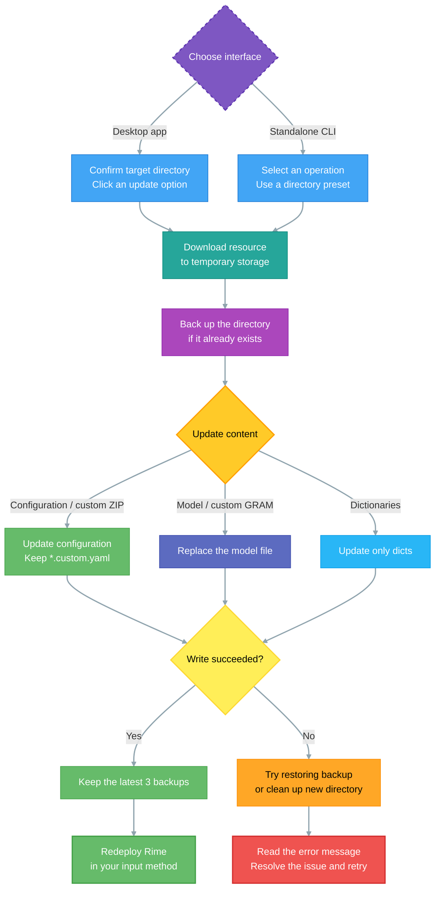

# Importing Oh-My-Rime

In the previous steps, you have learned how to install the Rime input method.

In fact, Rime can be configured as any input method, such as Minnan language input method, Wu language input method, Cantonese input method, and so on. You can also configure key mappings, such as inputting "ABC" but getting "CBA" or fuzzy pinyin.

However, all of this might be a bit complex for a new user. When exploring Rime's configuration, it is recommended to use pre-configured templates created by others, such as "Wusong Pinyin" or the "Oh-My-Rime" introduced in this article.

There are three methods for installing:

- **Manual override installation of configuration files**: After downloading and installing the Rime client, manually download the Oh-my-rime configuration files, move them to the configuration directory, and then redeploy.
- Installation of Oh-my-rime configuration via Dongfeng Po: Suitable for most desktop Rime clients, with Dongfeng Po configured, you can directly import the Oh-my-rime configuration scheme with one click.
- **[Desktop app or CLI](#⭐cli-import-and-update-oh-my-rime)**: Use Oh My Rime to import and update configurations, models, and dictionaries without installing Git.

This chapter starts with manual installation, then covers Plum and the desktop app / CLI.

## Downloading Oh-My-Rime

Oh-My-Rime is an open-source project that uses the [GPL 3.0](https://github.com/Mintimate/oh-my-rime/blob/main/LICENSE) license. This means you can access its source code and customize it according to your needs. However, please comply with the open-source license and do not use it for commercial purposes.

Let's go to the project page of Oh-My-Rime:

- [Oh-My-Rime GitHub Repository: https://github.com/Mintimate/oh-my-rime](https://github.com/Mintimate/oh-my-rime)
- [Oh-My-Rime CNB Repository: https://cnb.cool/Mintimate/rime/oh-my-rime](https://cnb.cool/Mintimate/rime/oh-my-rime)

Download Oh-My-Rime to your local machine:


::: info Notification

If you're unsure which file to download on GitHub, or the download speed is too slow; you can use the mirror download provided by Oh-my-rime (thanks to [CNB](https://cnb.cool) for computing power and storage support; automatically packaged Mintimate configuration):
- [Oh-my-Rime Configuration Package （CNB Mirror）](https://cnb.cool/Mintimate/rime/oh-my-rime/-/releases/download/latest/oh-my-rime.zip)

:::

After extracting the downloaded file, the internal files should look like this:


## Moving the Configuration Files

Once we have extracted Oh-My-Rime, we need to move the configuration files to Rime's configuration directory.

The default configuration file locations are:

- For macOS with Squirrel: `~/Library/Rime/`
- For macOS Fcitx5: `~/.local/share/fcitx5/rime`
- For Windows with Weasel: `%APPDATA%/Rime`
- For Linux with ibus: `~/.config/ibus/rime`
- For Linux with Fcitx5: `~/.local/share/fcitx5/rime`
- For Linux with Fcitx5(Flatpak): `~/.var/app/org.fcitx.Fcitx5/data/fcitx5/rime`
- Android Fcitx(Fcitx5 For Android): `/storage/emulated/0/Android/data/org.fcitx.fcitx5.android/files/data/rime/`

Additionally, on macOS with Squirrel and Windows with Weasel, you can open the configuration directory using software. For example, on macOS:


For Fcitx Little Penguin on Android, you can use the MT file manager to open the address of the configuration file (you can try searching for `fcitx.fcitx5` in the file manager):


::: info
The picture shows that the Oh-my-rime Input Method has been installed. Otherwise, the configuration file address on the left should be an empty folder.
:::

After opening the configuration directory, move the Oh-My-Rime configuration files into it:


## Deploying Oh-My-Rime

After completing the above steps, we can deploy Rime, for example, on macOS with Squirrel:


Similarly,Fcitx5 For Android, there are some special features that need to be operated in any interface that can be entered:


Once the deployment is complete, you can start using Oh-My-Rime.

## ⭐Oh-my-rime with Plum
If you are familiar with Plum, you can directly import the Oh-my-rime input configuration through it. The prerequisites for using Plum are:
- Git is already installed and configured in the environment variables.

For Windows users, Weasel actually comes with a semi-finished version of Plum. You can activate Plum in Weasel's `Scheme Menu Settings` under `Get More Input Schemes`:


After that, enter the Oh-my-rime recipe in this interface:
```text
Mintimate/oh-my-rime:plum/full
```


Note that if Git is not configured on your computer, you may need to enter plum first, which will automatically configure and download Git before activating the full version of Plum.


> References: [Windows下使用东风破安装异常](https://github.com/Mintimate/oh-my-rime/issues/123)、[Plum Wiki: 安装与更新输入方案](https://github.com/rime/weasel/wiki/%E5%AE%89%E8%A3%85%E4%B8%8E%E6%9B%B4%E6%96%B0%E8%BE%93%E5%85%A5%E6%96%B9%E6%A1%88)

::: info Guide🥳
What is the tool that displays system configuration in the Terminal? Here：[摸不透系统当前状态和配置？一条命令快速查看! NeoFetch和FastFetch使用详解](https://www.bilibili.com/video/BV1fHYLeSEr4/)
:::

If you are using macOS or Linux, you can enter the Plum command in the terminal:
```bash
# Install Plum, this will clone a plum project in the current directory
curl -fsSL https://raw.githubusercontent.com/rime/plum/master/rime-install | bash
# Enter the Plum directory
cd plum
```


In this directory, enter the Oh-my-rime recipe:
```bash
# Install the Oh-my-rime input method (scheme configuration)
./rime-install Mintimate/oh-my-rime:plum/full
```


By default:
- macOS is automatically recognized as Squirrel, which means installing the configuration scheme to `~/Library/Rime/`.
- Linux is automatically recognized as ibus, which means installing the configuration scheme to `~/.config/ibus/rime`.

If your Linux uses Fcitx5, you can specify the installation directory for the configuration files with the `rime_frontend` parameter or `rime_dir`:
```bash
# Specify installation to the Fcitx configuration directory
rime_frontend=fcitx-rime bash rime-install Mintimate/oh-my-rime:plum/full
# Or specify the installation configuration directory
rime_dir="$HOME/.config/fcitx/rime" bash rime-install Mintimate/oh-my-rime:plum/full
# Specify installation to the Fcitx5 configuration directory(macOS)
rime_dir="$HOME/.local/share/fcitx5/rime" bash rime-install Mintimate/oh-my-rime:plum/full
```

Reference:
- [rime-plum](https://github.com/rime/plum)

## ⭐Import and Update with the Desktop App or CLI {#⭐cli-import-and-update-oh-my-rime}

[Oh My Rime (OMR)](https://github.com/Mintimate/oh-my-rime-cli) manages Oh-My-Rime configurations on macOS, Windows, and Linux without requiring Git. Although the repository is still named `oh-my-rime-cli`, it now provides both a **desktop app** and a **standalone CLI**. The desktop app is a convenient choice if you are unfamiliar with the terminal.

This tool manages Rime configuration files. [Install a Rime input method client](./installRime) before using it. Since v4.0.0, the desktop app has a new interface and supports automatic app updates. Users of the old Go/Wails version need to install the new version manually once.


This screenshot comes from the project and illustrates the interface; check the release page for the current version. The desktop app supports light, system, and dark themes.

### Download and Install

Download from the project release pages and choose the file for your operating system and processor architecture:

- [GitHub Releases](https://github.com/Mintimate/oh-my-rime-cli/releases)
- [CNB mirror](https://cnb.cool/Mintimate/rime/oh-my-rime-cli/-/releases)

| Platform | Desktop installer | Standalone CLI |
| --- | --- | --- |
| macOS Apple Silicon (M series) | `Oh-My-Rime_<version>_macOS_arm64.dmg` | `cli-macos-arm64` |
| macOS Intel | `Oh-My-Rime_<version>_macOS_x64.dmg` | `cli-macos-x64` |
| Windows x64 | `.msi` or `-setup.exe` | `cli-windows-x64.exe` |
| Linux x64 | `.AppImage`, `.deb`, or `.rpm` | `cli-linux-x64` |

Choose a stable release for normal use; releases marked **Pre-release** are test versions. `.app.tar.gz`, `.sig`, and `latest.json` are used by the app updater. For manual installation on macOS, choose a `.dmg`.

- **macOS**: Open the DMG, drag `Oh My Rime.app` into Applications, then launch it from Applications.
- **Windows**: Run the `.msi` or `-setup.exe` installer, follow the setup wizard, and launch the app.
- **Linux**: Install the `.deb` / `.rpm` for your distribution, or grant execute permission to the `.AppImage` and run it.

::: info First launch
The macOS app currently uses ad-hoc signing and has not been notarized by Apple. If macOS cannot verify the developer, verify the download source, attempt to open the app, then go to **System Settings → Privacy & Security → Open Anyway** and follow the prompts. See [Apple's instructions](https://support.apple.com/102445).

Windows installers currently have no code signature. Use the project release pages above and verify the download source.
:::

### Update Configurations with the Desktop App

1. Open **方案更新** (configuration updates) and select your input method under **目标目录** (target directory). You can also use the folder button or enter a path under **自定义路径**.
2. Confirm the directory, then click the card for the resource you want to update. For a first installation, choose **薄荷方案**. For a custom resource, enter a direct download URL and click **更新** next to the URL field.
3. Follow the status under **任务进度** (task progress). If needed, open **运行日志** to view or copy logs from the current session.
4. After the update finishes, **redeploy Rime** through Squirrel, Weasel, Fcitx5, or iBus to apply the changes.

| Update option | Behavior |
| --- | --- |
| 薄荷方案 (Oh-My-Rime configuration) | Downloads and updates the configuration package, preserving existing `*.custom.yaml` files. |
| 万象模型 (Wanxiang model) | Updates `wanxiang-lts-zh-hans.gram` in the target directory. Follow the [language model guide](./languageModel) to enable it. |
| 万象词库 (Wanxiang dictionaries) | Downloads the Oh-My-Rime package and updates only its `dicts/` directory. |
| 自定义资源 (custom resource) | Accepts direct `.zip` or `.gram` download URLs. ZIP files follow the configuration update process; GRAM files are saved as `wanxiang-lts-zh-hans.gram`. ZIP contents should match the Rime directory layout without an extra enclosing folder. |

Directory presets include Squirrel and Fcitx5 on macOS, and iBus, Fcitx5, and Fcitx5 Flatpak on Linux. On Windows, the tool first reads Weasel's `RimeUserDir` registry value, falling back to `%APPDATA%\Rime`. If you have several input methods installed, select the configuration directory for the one you use.

::: tip Customization and backups
Keep personal changes in [`*.custom.yaml` patch files](./configurationOverride). Direct edits to files supplied by the configuration package may be overwritten during an update.

Both the desktop app and CLI download resources to temporary storage before backing up an existing target directory and applying changes. If applying the update fails, the tool attempts to restore the backup. Backups are stored beside the target directory in `<directory-name>.backups`, such as `Rime.backups`; the latest 3 are retained after a successful update. No previous-configuration backup is created if the target directory does not exist yet.
:::

### Use the Standalone CLI

Download the standalone CLI listed for your platform. On macOS or Linux, open a terminal in the download directory. For example, on macOS Apple Silicon:

```bash
# Grant execute permission
chmod +x ./cli-macos-arm64
# Start the interactive menu
./cli-macos-arm64
```

Use `cli-macos-x64` on Intel Macs or `cli-linux-x64` on Linux x64 instead. `chmod +x` grants execute permission; it does not require running the tool with `sudo`.

On Windows, double-click `cli-windows-x64.exe`, or open PowerShell in its directory and run:

```powershell
.\cli-windows-x64.exe
```

Enter an option and press Enter:

| Input | Action |
| --- | --- |
| `1` | Update the Oh-My-Rime configuration |
| `2` | Update the Wanxiang model |
| `3` | Update the Wanxiang dictionaries |
| `4` | Enter a custom `.zip` / `.gram` download URL |
| `q` | Exit |

After you choose an action, macOS and Linux show directory presets. Enter a number to select one, or press Enter to use the first preset. Windows uses the detected Weasel directory. The current standalone CLI has no prompt for entering a custom target path; use the desktop app if you need one. Redeploy Rime after updating.

### Configuration Update Flow

The desktop app and CLI share the same update process. Custom ZIP files follow the configuration update path; custom GRAM files follow the model update path. Redeploy Rime after updating:



### Update the Tool Itself

The desktop app checks for new versions at startup. You can also click **检查应用更新** (check for app updates) at the bottom left. When an update is available, review its release notes and click **下载并安装** (download and install). The app verifies the update signature, installs it, and restarts.


The screenshot shows a channel with no available app update.

- Stable releases receive only stable updates by default. Test releases initially accept prereleases; the **接收测试版** setting changes this preference and is saved.
- App updates cannot be installed while a Rime configuration update is running. On macOS, launch from Applications, not from the read-only DMG.
- In-app updates currently check and download from GitHub. If the network is unavailable, retry later or download an installer manually from the CNB mirror.
- Old Go/Wails versions require a manual installation of the new app. The standalone CLI also requires manual updates from the release page.

**App updates** upgrade the OMR tool. **Configuration updates** change Rime configurations, models, or dictionaries and require redeploying the input method afterward.

For more information and source code, see the [oh-my-rime-cli project](https://github.com/Mintimate/oh-my-rime-cli) ([CNB mirror](https://cnb.cool/Mintimate/rime/oh-my-rime-cli)).
