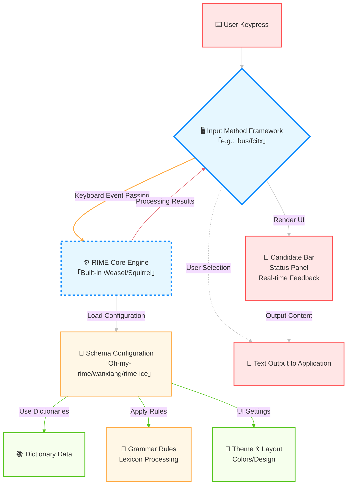

Here is an English translation of the Rime configuration tutorial:

# Configuration Tutorial

Now, let's start configuring Oh-my-rime for Rime. Actually the configuration is quite simple. You just need to download and install Rime for your current system, then import Oh-my-rime and redeploy.

Of course, if you want to customize based on your preferences first, it may be a bit difficult for beginners. It is recommended to learn more with search engines and Rime official docs while following this document.

If you find this document or Oh-my-rime Pinyin useful, you can buy me a coffee:

<donate lang="en" />

> Please be sure to leave a note "Mint Pinyin" or "oh-my-rime". Donors of coffee ☕️ will be credited in the "[Acknowledgements](#Acknowledgements)" (●'◡'●)ノ♥

## Basic Concepts
Oh-my-rime is an input schema, while RIME is actually an algorithmic core. To form a complete client input method, an input method framework is also required. ​**​These three layers together constitute an input method​​**.

Squirrel (for macOS) and Weasel (for Windows) can be understood as a combination of the input method framework and the RIME core engine. Only the schema needs to be installed for immediate use. On Android and Linux, however, Fcitx5 serves as the input method framework. It requires installing the RIME core engine to support RIME schemas. The relationship is as follows:

```mermaid
%%{init: {'theme': 'base', 'themeVariables': { 'nodeBorder': '#888' }}}%%
flowchart TD
    A[⌨️ User Keypress] --> B{🖥️ Input Method Framework<br/>「e.g.: ibus/fcitx」}
    B -->|Keyboard Event Passing| C[⚙️ RIME Core Engine<br/>「Built-in Weasel/Squirrel」 ]
    C -->|Load Configuration| D[👑 Schema Configuration<br/>「Oh-my-rime/wanxiang/rime-ice」]
    D -->|Use Dictionaries| E[📚 Dictionary Data]
    D -->|Apply Rules| F[📐 Grammar Rules</br/>Lexicon Processing]
    D -->|UI Settings| G[🎨 Theme & Layout<br/>Colors/Design]
    C -->|Processing Results| B 
    B -->|Render UI| H[👀 Candidate Bar<br/>Status Panel<br/>Real-time Feedback]
    B -.-> |User Selection| I[📝 Text Output to Application]
    H -->|Output Content| I

    classDef user fill:#ffe6e6,stroke:#ff4d4f,stroke-width:2px,min-width:180px,min-height:40px,padding:10px;
    classDef engine fill:#e6f7ff,stroke:#1890ff,stroke-width:3px,min-width:220px,min-height:60px,padding:12px;
    classDef config fill:#fff7e6,stroke:#ffa940,stroke-width:2px,min-width:180px,min-height:60px,padding:10px;
    classDef data fill:#f6ffed,stroke:#52c41a,stroke-width:2px,min-width:150px,min-height:50px,padding:10px;
    
    class A,I user;
    class B,C engine;
    class D,F config;
    class E,G data;
    class H user;

    style C stroke:#1890ff,stroke-width:3px,stroke-dasharray:5 5,min-height:60px
    linkStyle 1 stroke:#ffa940,stroke-width:2px
    linkStyle 3,4,5 stroke:#52c41a
    linkStyle 6 stroke:#E2626C
    linkStyle 0,2,7,8,9 stroke:#bfbfbf
```

 I created a cartoon illustration to explain the interdependency between the three components:

## Recommended Tutorials

Here are some recommended tutorials to assist with advanced customization:

- [Rime Official Wiki Docs](https://github.com/rime/home/wiki)
- [Rime Schema Customization Guide](https://github.com/LEOYoon-Tsaw/Rime_collections/blob/master/Rime_description.md)
- [Wuqing Pinyin](https://dvel.me/posts/rime-ice/)

## Acknowledgements

At the same time, Oh-my-rime configuration is inseparable from the abundant tutorials online. Oh-my-rime references heavily from:

- rime-ice Pinyin: https://github.com/iDvel/rime-ice

Thank you to Afdian supporters:

| Date       | Platform | User                                                                      | Donate💵         | Comment                                                                                             |
| ---------- | -------- | ------------------------------------------------------------------------- | --------------- | --------------------------------------------------------------------------------------------------- |
| 2026/03/10 | 微信赞赏 | 微信用户: AA～电脑城-弯儿师傅 | 100¥   | 薄荷拼音很好用，电脑手机都用上了 |
| 2025/12/25 | 微信赞赏 | 微信用户: cyrasafia | 30¥   | -- |
| 2025/12/15 | 微信赞赏 | 微信用户 | 50¥   | 感谢维护，全平台换了薄荷拼音方案 |
| 2025/12/09 | 微信赞赏 | 微信用户: 周彦铭 Silver | 10¥   | 挺好用, gj! |
| 2025/11/23 | 微信赞赏 | 微信用户: ^^ | 50¥   | 输入法我只用薄荷 |
| 2025/11/22 | 微信赞赏 | 微信用户: 何唯是真名er | 10¥   | 昨天用上的，谢谢了。这么棒的作品 |
| 2025/11/13 | 微信赞赏 | 微信用户: tyfanchz | 20¥   | 感谢大大们维护的好用的方案！ |
| 2025/11/04 | 微信赞赏 | 微信用户: 培公啊 | 10¥   | -- |
| 2025/10/05 | 爱发电 | QQ用户: Lii(892***084) | 100¥   | 薄荷输入法简直丝滑无比 |
| 2025/10/25 | 爱发电 | QQ用户: 白水(290***894) | 100¥   | 期待您的回复 |
| 2025/09/03 | 微信赞赏 | 微信用户: Derek | 20¥   | Derek |
| 2025/07/24 | 爱发电 | 微信用户: Xinyi | 50¥   | 膜雨月大佬，教程写得很有帮助，希望能交流一次呀 |
| 2025/06/08 | 微信赞赏 | 微信用户: 东方 | 28¥   | 希望可以导入“王码” |
| 2025/06/06 | 微信赞赏 | 微信用户: 「匿名用户」 | 10¥   | 薄荷输入法 |
| 2025/04/10 | 微信赞赏 | 微信用户: fix u                                                           | 10¥             | 感谢作者开源🙏                                                                                       |
| 2025/01/03 | 微信赞赏 | QQ用户:凌(873**534)                                                       | 5¥              | 感谢在QQ群无私的帮助                                                                                |
| 2025/01/04 | 爱发电   | [爱发电用户_NVKP](https://afdian.com/u/b5636c3aca4d11ef8f5a5254001e7c00)  | 15¥             | oh-my-rime                                                                                          |
| 2024/10/26 | 微信赞赏 | 微信用户: Jacian                                                          | 10¥             | 很好用的方案，希望一直维护下去                                                                      |
| 2024/10/20 | 微信赞赏 | 微信用户: Torjoy                                                          | 20¥             | 感谢大佬                                                                                            |
| 2024/09/27 | 微信赞赏 | RIME输入法交流小群群友                                                    | 10¥             | 叮，你要的奶茶                                                                                      |
| 2024/09/06 | 微信赞赏 | 微信用户: YANGZhitao                                                      | 20¥             | 很好用! 感谢维护这套方案                                                                            |
| 2024/08/21 | 微信赞赏 | 微信用户: ZY                                                              | 20¥             | 谢谢你维护这套方案                                                                                  |
| 2024/06/30 | 爱发电   | [奶茶不加冰](https://afdian.com/u/802ed17a36bf11efa4db52540025c377)       | 20¥             | 手机上已经用上了，体验非常好，感谢作者。                                                            |
| 2024/06/12 | 爱发电   | [爱发电用户_15aca](https://afdian.com/u/15aca804289b11efa13952540025c377) | 36¥             | oh-my-rime                                                                                          |
| 2024/06/11 | 爱发电   | [爱发电用户_9d84b](https://afdian.com/u/9d84b3ac280011efa1d352540025c377) | 20¥             | oh-my-rime, perfect!                                                                                |
| 2024/05/31 | 爱发电   | [爱发电用户_sYNg](https://afdian.com/u/c428e6701f1a11efab4a5254001e7c00)  | 20¥             | 一个月前就准备请up来杯奶茶了~今天是时候兑现一下了！感谢up的薄荷拼音真的非常好用~我已经全平台跟进啦~ |
| 2024/05/28 | 微信     | 公众号用户: 晶码战士                                                      | 50¥             | 薄荷输入法👍👍👍                                                                                       |
| 2024/04/28 | 爱发电   | [爱发电用户_UkCK](https://afdian.com/u/8717bcc8054511efbfc052540025c377)  | 20¥（一杯奶茶） | oh-my-rime                                                                                          |
| 2024/03/15 | 爱发电   | [爱发电用户_520f9](https://afdian.com/u/520f9e12e26111eeaa3a5254001e7c00) | 50¥（KFC）      | 辛苦了，希望能持续更新下去！                                                                        |
| 2024/01/22 | 爱发电   | [爱发电用户_8b769](https://afdian.com/u/8b769b02b8c111ee928952540025c377) | 50¥（KFC）      | Hi, 感谢维护oh-my-rime                                                                              |

## Discussion Group

If you have QQ and want to explore and discuss Rime together:

- QQ Group: 703260572 (Reject ads, support casual chat~)

> Note: This is a discussion group, not a customer service group. It is also an open source project, so there is no after-sales or customer service relationship.

You can also discuss in GitHub [Issues](https://github.com/Mintimate/oh-my-rime/issues) and [Discussions](https://github.com/Mintimate/oh-my-rime/discussions). Please also note GitHub's guidelines for Issues and similar features. The maintainer strives to remain neutral and uphold open-source principles. Some Issues may be closed after resolution (which is normal and follows standard Issue handling practices). Do not go to already closed Issues to complain about other features or even criticize the maintainer for "not acknowledging" problems—this is meaningless, as the commit history is right there for all to see.

> Do I have any commercial motives? What would be the point of "not acknowledging" any issues? Is it really that "the silent majority doesn’t express gratitude, while only a minority facing difficulties keeps complaining"? You can treat this as unseen—just some thoughts sparked while handling Issues 😫.