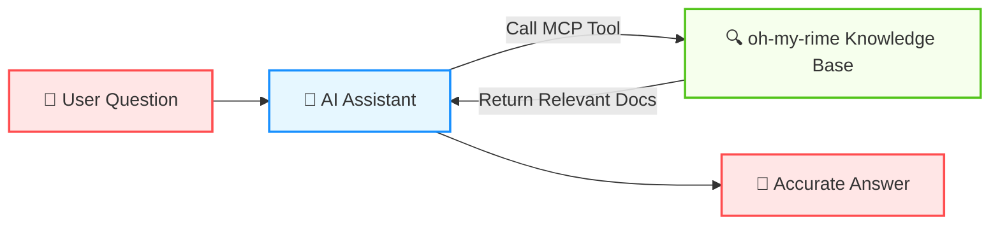
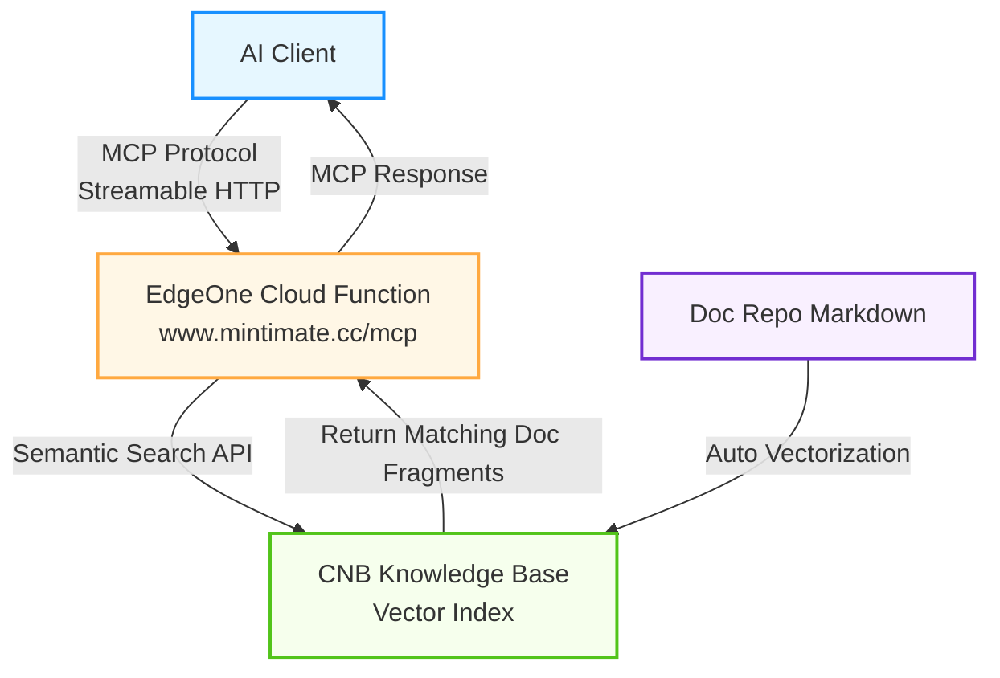

# AI MCP Service <Badge type="tip" text="New" />

Oh-my-rime provides a knowledge base query service based on [MCP (Model Context Protocol)](https://modelcontextprotocol.io/). With MCP, you can let **AI editors** (such as Cursor, Windsurf, VS Code, etc.) directly access the oh-my-rime documentation knowledge base, getting accurate configuration tutorials and usage guides during AI conversations.

> In short: After configuring MCP, you can ask questions about oh-my-rime directly in your AI editor, and the AI will automatically query our knowledge base to answer you.

## What is MCP?

MCP (Model Context Protocol) is an open protocol proposed by Anthropic to standardize the interaction between AI models and external data sources and tools. Think of it as a "plugin system" for AI assistants — through MCP, AI can call external tools to retrieve real-time, accurate information instead of relying solely on training data.



## Service Information

| Item | Description |
|------|-------------|
| **Endpoint** | `https://www.mintimate.cc/mcp` |
| **Transport** | Streamable HTTP |
| **Protocol Version** | `2025-03-26` |
| **Available Tool** | `query_oh-my-rime` — Semantic search of the oh-my-rime knowledge base |

## Configuration in AI Editors

### Cursor

Create a `.cursor/mcp.json` file in the project root directory, or add it in Cursor's global settings:

```json
{
  "mcpServers": {
    "oh-my-rime-knowledge": {
      "url": "https://www.mintimate.cc/mcp",
      "transport": "streamable-http"
    }
  }
}
```

### Windsurf

Add the following to Windsurf's MCP configuration:

```json
{
  "mcpServers": {
    "oh-my-rime-knowledge": {
      "serverUrl": "https://www.mintimate.cc/mcp",
      "transport": "streamable-http"
    }
  }
}
```

### VS Code (GitHub Copilot)

Create a `.vscode/mcp.json` file in the project root directory:

```json
{
  "servers": {
    "oh-my-rime-knowledge": {
      "type": "http",
      "url": "https://www.mintimate.cc/mcp"
    }
  }
}
```

### Claude Desktop

Add the following to the Claude Desktop configuration file (config file path: on macOS `~/Library/Application Support/Claude/claude_desktop_config.json`, on Windows `%APPDATA%\Claude\claude_desktop_config.json`):

```json
{
  "mcpServers": {
    "oh-my-rime-knowledge": {
      "url": "https://www.mintimate.cc/mcp",
      "transport": "streamable-http"
    }
  }
}
```

::: tip Note
The configuration format may vary slightly across different AI editors/clients. Please refer to the official documentation of your tool. The examples above are for reference only — the key point is to set the MCP endpoint `https://www.mintimate.cc/mcp` in the corresponding MCP settings.
:::

## Usage

Once configured, you can directly ask questions about oh-my-rime in your AI conversation, and the AI will automatically invoke the `query_oh-my-rime` tool to query the knowledge base. For example:

- *"How do I install oh-my-rime on macOS?"*
- *"How to configure fuzzy pinyin in oh-my-rime?"*
- *"How to enable the XiaoHe double pinyin scheme?"*
- *"What is configuration override in Rime?"*

### Tool Parameters

The `query_oh-my-rime` tool supports the following parameters:

| Parameter | Type | Required | Description |
|-----------|------|----------|-------------|
| `query` | string | ✅ | Natural language query, supports both Chinese and English. e.g. `How to configure oh-my-rime` |
| `keyword` | string | ❌ | Keyword filter, multiple keywords separated by semicolons. e.g. `macOS;install;Rime` |

::: info Note
MCP tool invocations are typically handled automatically by the AI assistant. You just need to ask in natural language — there's no need to manually pass these parameters.
:::

## Technical Implementation

This MCP service is deployed on [EdgeOne Pages Cloud Functions](https://edgeone.ai/), leveraging the vector semantic search capabilities of the CNB knowledge base. The Markdown content from the documentation repository is automatically vectorized and indexed, enabling high-precision semantic search.

The overall architecture is as follows:


