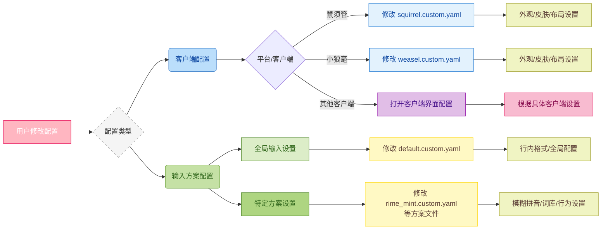
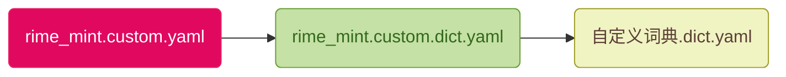

# 配置覆写和定制
定制很好理解，薄荷输入法基于Rime输入法框架，实际就是一套Rime输入法配置；不同的Rime客户端都有大量的个性化配置。

虽然薄荷输入法已经进行了大量的设置，但是**还有很多配置并没有激活；用户可以根据自己的喜好进行配置**。

至于覆写，就是**薄荷输入法已经对Rime输入法的客户端进行了配置**，但是可能不符合你的喜好，那么**你可以对其进行覆写**:



## Rime的个性配置文件
Rime的配置总体分为两种：
- 输入法的应用配置: 一般是设置客户端的外观，每个客户端可能有所不一样。比如: macOS(鼠须管) 和 Windows(小狼毫) 上设置输入法的外观和纵向输入等。
- 输入法方案配置: 设置输入法的方案内部的配置；比如: 设置在半角的情况下输入句号的形式、输入法翻页快捷键等。

一般来讲，如果是想自定义外观展示的，那么就设置「输入法的应用配置」，macOS上就是`squirrel.yaml`和`squirrel.custom.yaml`；而Windows上就是`weasel.yaml`和`weasel.custom.yaml`。

如果想覆写输入的内容和方式，那么就是设置「输入法方案配置」，这个又分为「全局输入设置(default)」和「输入方案设置(scheme)」；同样，作为设置也有`带custom的自定义文件`和不带`custom的schema文件`。

> 为什么都有`带custom`和`不带custom`的两种呢？ 
>> 其实，**不带custom的是配置的定制，用于实现配置**；**带custom的则是配置的覆写，用于覆写不带custom的某些配置；其他内容继承不带custom配置**。

## 输入法的应用配置
首先，我们看看应用的配置。方便我们把输入法的外观进行修改。

以薄荷输入法为例，我们已经安装了薄荷输入法，如果在macOS上，可以打开`squirrel.yaml`这个文件。薄荷输入法已经基于官方的配置: [鼠须管源码内的配置](https://github.com/rime/squirrel/blob/master/data/squirrel.yaml)

如果你的项目里没有`squirrel.yaml`这个文件，那么就会使用官方的配置。同理，如果你在Windows上，没有`weasel.yaml`这个文件，那么就是使用: [小狼毫源码内的配置](https://github.com/rime/weasel/blob/master/output/data/weasel.yaml)

内容参考(`squirrel.yaml`文件节选参考):
```yaml
style:
  # 选择皮肤，亮色与暗色主题
  color_scheme: mint_light_blue
  color_scheme_dark: mint_dark_blue
  
  # 预设选项。如果皮肤没写，则使用这些属性；如果皮肤写了，使用皮肤的。
  text_orientation: horizontal  # horizontal | vertical
  candidate_list_layout: stacked # stacked | linear  候选项排列方向（如果你想调整为横屏，可以调整这个）
  
  # 内嵌预编辑
  inline_preedit: true
  # 选中框 圆角半径
  hilited_corner_radius: 0
  # 窗口边界高度，大于圆角半径才生效
  border_height: 0
  # 窗口边界宽度，大于圆角半径才生效
  border_width: 0
  # 外边框 圆角半径
  corner_radius: 10
  # 色彩空间： srgb | display_p3
  color_space: srgb
  line_spacing: 5
  spacing: 10
  #candidate_format: '%c. %@'
  #base_offset: 6
  # 全局字体及大小
  font_face: "PingFang SC"
  font_point: 16
  # 序号字体及大小
  label_font_face: "PingFang SC"
  label_font_point: 16
  # 注字体及大小
  comment_font_face: "PingFang SC"
  comment_font_point: 14
```
内部都有完善的注释，感兴趣可以按注释进行参考。

你可以直接更改这个文件后，重新部署。也可以修改`custom`文件（如果没有，那么可以自行在不带`custom`的同级目录创建）。

如果你想修改`custom`文件，需要注意:
- 开头需要使用`patch`进行描述；
- 覆写某些内容时，需要使用`""`指向到具体的内容。

举例: 修改鼠须管的布局为横向布局，那么`squirrel.custom.yaml`可以这样写: 
```yaml
patch:
  "style/horizontal": false
```
反例:
```yaml
patch:
  style:
    # 这样会把style内部的内容清空，只有一个horizontal配置
    horizontal: false
```

## 输入法方案配置

接下来，我们看看「输入法方案配置」，方案的全局配置是`default.yaml`和`defalut.custom.yaml`；对于局部，以薄荷输入法内全拼为例：
- `rime_mint.schema.yaml`就是一个局部配置（全拼）。`rime_mint.schema.yaml`内可以覆写`default.yaml`的配置。
- 创建`rime_mint.custom.yaml`文件，优先级高于`rime_mint.schema.yaml`。可以覆写`rime_mint.schema.yaml`的配置。

所以，优先级是:


目前，薄荷输入法已经实现了`default.yaml`配置。在使用薄荷配置的时候，会自动覆盖 rime 客户端(鼠须管、小狼毫等)系统自带的`default.yaml`。

所以：
- 如果你想自定义全局样式，推荐使用`default.custom.yaml`文件覆写`default.yaml`；
- 如果你想修改薄荷输入法内的全拼配置，推荐使用`rime_mint.custom.yaml`文件进行覆写（注意：是薄荷输入法内全拼配置；如果你是用薄荷输入法内的小鹤双拼，那么就是`double_pinyin_flypy.custom.yaml`文件，其他薄荷输入法内配置方案，以此类推）。

举例: 覆写全局的输入方案配置，设置候选为6个:
```yaml
patch:
  "menu/page_size": 6
```

反例:
```yaml
patch:
  menu:
    # 这样会把 menu 内容清空，只有一个page_size配置
    page_size: 6
```

没事，接下来本章节还有更多的例子，可以参考。

## 修改薄荷输入法的配置
薄荷内自带了很多的配置，但是可能不符合你的喜好。那么，你可以根据自己的喜好，进行覆写。

我们以「薄荷拼音」为例，我们想开启它的模糊拼音应该怎么操作呢？

它的配置文件是`rime_mint.schema.yaml`。我有时候更新时候，会修改这个文件，如果你想覆盖更新，如果不使用 Git 进行管理，可能会产生冲突。

所以，推荐使用`rime_mint.custom.yaml`文件进行覆写。这样，即使更新了，你也可以直接覆盖同名文件，不会影响你的配置。

综上所述，我们可以这样操作:
1. 打开或创建`rime_mint.custom.yaml`文件；
2. 根据后文 [模糊拼音](fuzzyPinyin.html) 章节，我们知道是需要覆写`speller/algebra`模块，使用`patch`进行覆写，

`rime_mint.custom.yaml`文件内容:
```yaml
# Rime schema
# encoding: utf-8

patch:
  speller/algebra:
    - erase/^xx$/ # 首选保留
    ## 模糊拼音
    - derive/^([zcs])h/$1/ # zh, ch, sh => z, c, s
    - derive/^([zcs])([^h])/$1h$2/ # z, c, s => zh, ch, sh
    - derive/([aei])n$/$1ng/ # en => eng, in => ing
    - derive/([aei])ng$/$1n/ # eng => en, ing => in
    - derive/([iu])an$/$lan/ # ian => iang, uan => uang
    - derive/([iu])ang$/$lan/ # iang => ian, uang => uan
    - derive/([aeiou])ng$/$1gn/        # dagn => dang
    - derive/([dtngkhrzcs])o(u|ng)$/$1o/  # zho => zhong|zhou
    - derive/ong$/on/                  # zhonguo => zhong guo
    - abbrev/^([a-z])[a-z]*$/$1/       # 简拼（首字母）
    - abbrev/^([zcs]h).+$/$1/          # 简拼（zh, ch, sh）
     ### 自动纠错
    # 有些规则对全拼简拼混输有副作用：如「x'ai 喜爱」被纠错为「xia 下」
    # zh、ch、sh
    - derive/([zcs])h(a|e|i|u|ai|ei|an|en|ou|uo|ua|un|ui|uan|uai|uang|ang|eng|ong)$/h$1$2/  # hzi → zhi
    - derive/([zcs])h([aeiu])$/$1$2h/  # zih → zhi
    # ai
    - derive/^([wghk])ai$/$1ia/  # wia → wai
    # ia
    - derive/([qjx])ia$/$1ai/  # qai → qia
    # ei
    - derive/([wtfghkz])ei$/$1ie/
    # ie
    - derive/([jqx])ie$/$1ei/
    # ao
    - derive/([rtypsdghklzcbnm])ao$/$1oa/
    # ou
    - derive/([ypfm])ou$/$1uo/
    # uo（无）
    # an
    - derive/([wrtypsdfghklzcbnm])an$/$1na/
    # en
    - derive/([wrpsdfghklzcbnm])en$/$1ne/
    # ang
    - derive/([wrtypsdfghklzcbnm])ang$/$1nag/
    - derive/([wrtypsdfghklzcbnm])ang$/$1agn/
    # eng
    - derive/([wrtpsdfghklzcbnm])eng$/$1neg/
    - derive/([wrtpsdfghklzcbnm])eng$/$1egn/
    # ing
    - derive/([qtypdjlxbnm])ing$/$1nig/
    - derive/([qtypdjlxbnm])ing$/$1ign/
    # ong
    - derive/([rtysdghklzcn])ong$/$1nog/
    - derive/([rtysdghklzcn])ong$/$1ogn/
    # iao
    - derive/([qtpdjlxbnm])iao$/$1ioa/
    - derive/([qtpdjlxbnm])iao$/$1oia/
    # ui
    - derive/([rtsghkzc])ui$/$1iu/
    # iu
    - derive/([qjlxnm])iu$/$1ui/
    # ian
    - derive/([qtpdjlxbnm])ian$/$1ain/
    # - derive/([qtpdjlxbnm])ian$/$1ina/ # 和「李娜、蒂娜、缉拿」等常用词有冲突
    # in
    - derive/([qypjlxbnm])in$/$1ni/
    # iang
    - derive/([qjlxn])iang$/$1aing/
    - derive/([qjlxn])iang$/$1inag/
    # ua
    - derive/([g|k|h|zh|sh])ua$/$1au/
    # uai
    - derive/([g|h|k|zh|ch|sh])uai$/$1aui/
    - derive/([g|h|k|zh|ch|sh])uai$/$1uia/
    # uan
    - derive/([qrtysdghjklzxcn])uan$/$1aun/
    # - derive/([qrtysdghjklzxcn])uan$/$1una/ # 和「去哪、露娜」等常用词有冲突
    # un
    - derive/([qrtysdghjklzxc])un$/$1nu/
    # ue
    - derive/([nlyjqx])ue$/$1eu/
    # uang
    - derive/([g|h|k|zh|ch|sh])uang$/$1aung/
    - derive/([g|h|k|zh|ch|sh])uang$/$1uagn/
    - derive/([g|h|k|zh|ch|sh])uang$/$1unag/
    - derive/([g|h|k|zh|ch|sh])uang$/$1augn/
    # iong
    - derive/([jqx])iong$/$1inog/
    - derive/([jqx])iong$/$1oing/
    - derive/([jqx])iong$/$1iogn/
    - derive/([jqx])iong$/$1oign/
    # 其他
    - derive/([rtsdghkzc])o(u|ng)$/$1o/ # do → dou|dong
    - derive/ong$/on/ # lon → long
    - derive/([tl])eng$/$1en/ # ten → teng
    - derive/([qwrtypsdfghjklzxcbnm])([aeio])ng$/$1ng/ # lng → lang、leng、ling、long
```

对比一下`rime_mint.custom.yaml`和`rime_mint.schema.yaml`：


## 举例: 输入法横向输入
如果你想在macOS上，将输入法的布局改为横向输入，那么可以这样操作:
1. 打开或创建`squirrel.custom.yaml`文件；
2. 使用`patch`进行覆写，将`candidate_list_layout`改为`linear`；

可能的内容:
```yaml
patch:
  # stacked | linear | tabled 候选项排列方向(如果希望水平，设置linear)
  style/candidate_list_layout: linear
```

::: warning 警告
如果你的输入法皮肤里设置有`candidate_list_layout: stacked`，根据局部配置大于全局配置的原因，那么这个设置可能会失效。

同时，目前`candidate_list_layout`的配置优先级大于`horizontal: true`的优先级，不过如果`candidate_list_layout`设置无效（如: 小狼毫上，设置`weasel.custom.yaml`内`style/candidate_list_layout`为`linear`无效，就需要设置`horizontal: true`。

:::

## 举例: 自定义皮肤
如果你想自定义皮肤，那么首先就要明确你当前的 rime 客户端。不同的客户端，使用的皮肤也不同，所以你需要根据自己的客户端，来进行修改。

薄荷输入法(输入方案)，内部集成了两套可以在小狼毫和鼠须管内使用的皮肤: 水鸭系列、青涩系列。

客户端鼠须管，如果想把水鸭系列的皮肤改为青涩系列，在`squirrel.custom.yaml`文件内 `patch` 如下:
```yaml
# 一个文件内只能有一个 patch 节点
patch:
  # 覆写亮色模式皮肤为 mint_light_green(碧皓青)
  "style/color_scheme": mint_light_green
  # 覆写亮色模式皮肤为 mint_light_green(碧月青)
  "style/color_scheme_dark": mint_dark_green
```

之后，重新部署即可。

客户端小狼毫，如果想把青涩系列的皮肤改为水鸭系列，也是上述方法，只不过文件名为 `weasel.custom.yaml`。

实际上，能 `patch` 的属性，取决于不带`custom`的文件。

所以，不要以为鼠须管和小狼毫能修改的配置都是一样的。具体可以修改那些外观配置，建议查看`squirrel.yaml`和`weasel.yaml`文件，然后根据自己的需求进行修改。

## 举例: 自定义词库
如果你想自定义词库，那么可以这样操作，以薄荷输入法内的「薄荷拼音-全拼输入」为例：

1. 在 `dicts` 目录下参考`rime_mint.chars.dict.yaml`创建一个以`.dict.yaml`为结尾的词库文件。例如：`my_custom_dicts.dict.yaml`。在其中填充你自己的词典。**注意内部的 Tab 和空格，建议使用 [VSCODE](https://code.visualstudio.com/download) 打开。**
2. 在项目根目录下参考薄荷自带的`rime_mint.dict.yaml` 词库配置文件创建`rime_mint.custom.dict.yaml`，引用`1`中创建的自定义词典。例如下方代码中的`dicts/my_custom_dicts`。建议把薄荷自带的词库`rime_mint.dict.yaml`拷贝一份，然后进行修改。
```yaml
---
name: rime_mint                  # 注意name和文件名一致
version: "2025.07.06"
sort: by_weight
use_preset_vocabulary: false
# 此处为 输入法所用到的词库，既补充拓展词库的地方
# 雾凇拼音词库，由Github Robot自动更新
import_tables:
  - dicts/custom_simple          # 自定义
  - dicts/rime_mint.chars        # 单字词库（万象拼音词库基础版本）
  - dicts/rime_mint.base         # 基础词库（万象拼音词库基础版本）
  - dicts/rime_mint.correlation  # 关联词库（万象拼音词库基础版本）
  - dicts/rime_mint.compatible   # 兼容词库（万象拼音词库基础版本）
  - dicts/rime_mint.ext          # 联想词库（万象拼音词库基础版本）
  - dicts/other_kaomoji          # 颜文字表情（按`VV`呼出)
  - dicts/rime_ice.others        # 雾凇拼音 others词库（用于自动纠错）
  - dicts/my_custom_dicts        # 在 dicts 下，参考 rime_mint.chars.dict.yaml 文件新建的 my_custom_dicts.dict.yaml
  # 20240608 Emoji完全交由OpenCC，不再使用字典作为补充
  # - dicts/other_emoji            # Emoji(仅仅作为补充，实际使用一般是OpenCC生效)
...
```
3. 打开或创建`rime_mint.custom.yaml`文件，使用`patch`进行覆写，将`translator/dictionary`改为你的自定义词库配置。按照`2`中新建的`rime_mint.custom.dict.yaml`就是`rime_mint.custom`。
`rime_mint.custom.yaml`可能的内容:
```yaml
patch:
  # 设置「薄荷拼音-全拼输入」的词典，使用 rime_mint.custom.dict.yaml 文件
  translator/dictionary: rime_mint.custom
```

4. 其他
这里需要注意，你看到的`dicts`中薄荷自带的词库是这样的：
```yaml
# Rime dictionary
# encoding: utf-8
#https://github.com/amzxyz/RIME-LMDG
---
name: rime_mint.chars
version: "2025-10-29"
sort: by_weight

...
啊	a	915
阿	ā	749
啊	ā	537
锕	ā	346
啊	á	336
嗄	á	305
腌	ā	268
吖	ā	250
啊	à	146
啊	ǎ	19
呵	a	1
```

你会发现有音调，这是因为万象词库的特殊性做了音调处理。你自己设置的可以无须音调，比如 `dicts/my_custom_dicts.dict.yaml` 参考内容:

```yaml
# Rime dictionary
# encoding: utf-8
#https://github.com/amzxyz/RIME-LMDG
---
name: my_custom_dicts
version: "2025-10-01"
sort: by_weight

...
阿瓦隆	a wa long	915
```

> 这个方法，主要是一些用户一直想添加搜狗词库。虽然我认为完全没必要，现有词库也是 AMZ 经过分词模型计算得出，添加搜狗词库徒增卡顿；但是也提供一个方法，给想尝试的人。

扩展一下，词库内的音调是用来配合[oh-my-rime/lua/super_preedit.lua](https://github.com/Mintimate/oh-my-rime/blob/main/lua/super_preedit.lua)显示音调的。

## 举例: 拼音串最大长度

如果你使用薄荷方案，会发现输入的拼应串长度有限制。

举个例子，输入`geguoyougeguodeguogegediyougedidefangyan(各国有各国的国歌各地有个地的方言)`，当你在输入 25 个字符的时候，会自动截断。主要是**为了防止输入的拼音串过长，导致输入法卡顿**。薄荷方案使用 Lua 控制最大长度是 25 个字符。

目前，可以通过`patch`进行修改，将`codeLengthLimit_processor`改为你想要的长度。

举个例子，我们修改`薄荷拼音-全拼输入`的最大长度为 100，那么就追加或新建`rime_mint.custom.yaml`，添加`codeLengthLimit_processor`配置内容：

```yaml
patch:
    # 设置「薄荷拼音-全拼输入」的拼音串最大长度为 100
    codeLengthLimit_processor: 100
```

重新部署后，你的输入法就可以输入更长的拼音串了。