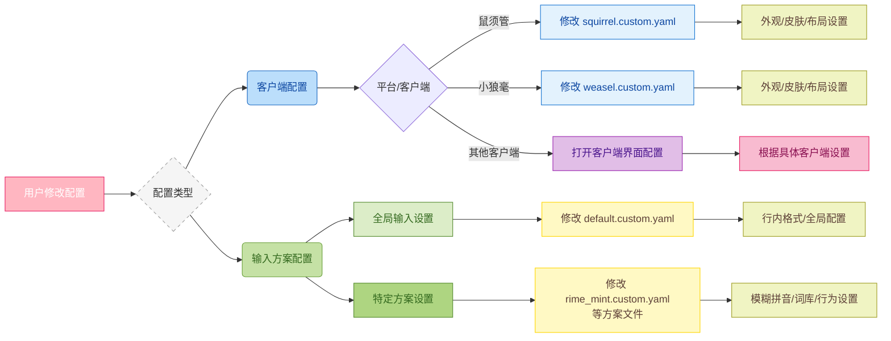

# 配置覆写和定制
定制很好理解，薄荷输入法基于Rime输入法框架，实际就是一套Rime输入法配置；不同的Rime客户端都有大量的个性化配置。

虽然薄荷输入法已经进行了大量的设置，但是**还有很多配置并没有激活；用户可以根据自己的喜好进行配置**。

至于覆写，就是**薄荷输入法已经对Rime输入法的客户端进行了配置**，但是可能不符合你的喜好，那么**你可以对其进行覆写**:

## 配置覆写速查

如果你是通过搜索或知识库检索来到这里，可以先看这张表。Rime 的 custom 文件都使用 `patch:` 写法，但要先判断自己要改的是“客户端外观”还是“输入方案行为”。

| 想修改的问题 | 推荐修改文件 | 常见 patch 路径或关键词 |
|------|------|------|
| 鼠须管外观、macOS 皮肤、候选栏方向 | `squirrel.custom.yaml` | `style/candidate_list_layout`、`style/horizontal`、`style/color_scheme`、`style/color_scheme_dark`、`font_face`、`font_point` |
| 小狼毫外观、Windows 皮肤、横向候选栏 | `weasel.custom.yaml` | `style/candidate_list_layout`、`style/horizontal`、`style/color_scheme`、`style/color_scheme_dark` |
| 全局方案列表、默认激活方案 | `default.custom.yaml` | `schema_list` |
| 薄荷全拼方案行为 | `rime_mint.custom.yaml` | `speller/algebra`、`translator/dictionary`、`recognizer/patterns`、`engine/filters`、`engine/translators` |
| 小鹤双拼方案行为 | `double_pinyin_flypy.custom.yaml` | `speller/algebra`、`aux_code/trigger_word`、`translator/preedit_format`、`menu/page_size` |
| 薄荷全拼 + 小鹤混输 | `rime_mint_flypy.custom.yaml` | `speller/algebra`、`translator/preedit_format`、`menu/page_size` |
| 候选词个数、翻页快捷键、Emoji 快捷键 | 对应方案的 `.custom.yaml` | `menu/page_size`、`key_binder/bindings`、`key_binder/bindings/@next` |
| 模糊拼音、简拼、自动纠错规则 | 对应方案的 `.custom.yaml` | `speller/algebra`、`speller/algebra/+` |
| 拼音手动分词、分隔符 | 对应方案的 `.custom.yaml` | `speller/delimiter` |
| 自定义词库、扩展词库 | 对应方案的 `.custom.yaml` + `.dict.yaml` | `translator/dictionary`、`import_tables` |
| 拼音串最大长度、过长输入截断 | 对应方案的 `.custom.yaml` | `codeLengthLimit_processor` |
| 符号输入、半角标点、自定义 `/` 符号 | 对应方案的 `.custom.yaml` | `punctuator/symbols`、`punctuator/half_shape`、`recognizer/patterns/punct` |

### patch 写法速查

`custom.yaml` 里通常只有一个顶层 `patch:`。如果要同时修改多个配置，请把它们都放到同一个 `patch:` 下，不要写多个 `patch:`。

| 目的 | 写法 | 说明 |
|------|------|------|
| 覆写一个值 | `"menu/page_size": 9` | 直接替换指定路径的值 |
| 覆写整个列表 | `speller/algebra: [...]` | 用你的列表替换原列表 |
| 追加到列表末尾 | `"speller/algebra/+": [...]` | 保留原列表，并把新规则追加到末尾 |
| 追加一个列表项 | `"key_binder/bindings/@next": {...}` | 常用于新增快捷键 |
| 修改最后一个列表项 | `"switches/@last": {...}` | 常用于给 switches 追加或调整最后一个开关 |
| 修改含 `/` 的键名 | `"punctuator/symbols//email": [...]` | 键名本身含 `/` 时需要双斜杠转义 |

推荐使用带引号的路径写法，例如 `"style/candidate_list_layout": linear`。不要轻易写成嵌套 map；如果只写 `style:` 再放一个子项，可能会把 `style` 下面其他配置整体清空。


```mermaid
graph LR
    U[用户修改配置]:::custom --> T{配置类型}:::decision
    T --> C1(客户端配置):::client
    T --> C2(输入方案配置):::schema
    
    C1 --> P{平台/客户端}
    P -->|鼠须管| S1[修改 squirrel.custom.yaml]:::clientFile
    P -->|小狼毫| S2[修改 weasel.custom.yaml]:::clientFile
    P -->|其他客户端| S3[打开客户端界面配置]:::otherClient
    
    S1 --> SA[外观/皮肤/布局设置]:::clientAttr
    S2 --> SB[外观/皮肤/布局设置]:::clientAttr
    S3 --> SC[根据具体客户端设置]:::otherAttr
    
    C2 --> G[全局输入设置]:::global
    C2 --> S[特定方案设置]:::specific
    
    G --> D[修改 default.custom.yaml]:::globalFile
    D --> GA[行内格式/全局配置]:::globalAttr
    
    S --> R[修改 rime_mint.custom.yaml<br>等方案文件]:::specificFile
    R --> SA1[模糊拼音/词库/行为设置]:::specificAttr

    classDef custom fill:#ffb6c1,stroke:#e91e63,color:#ffffff;
    classDef decision fill:#f5f5f5,stroke:#9e9e9e,color:#333333,stroke-dasharray: 5 5;
    classDef client fill:#bbdefb,stroke:#1565c0,color:#0d47a1;
    classDef clientFile fill:#e3f2fd,stroke:#1976d2,color:#0d47a1;
    classDef otherClient fill:#e1bee7,stroke:#9c27b0,color:#4a148c;
    classDef clientAttr fill:#f0f4c3,stroke:#9e9d24,color:#5d4037;
    classDef otherAttr fill:#f8bbd0,stroke:#e91e63,color:#880e4f;
    classDef schema fill:#c5e1a5,stroke:#689f38,color:#33691e;
    classDef global fill:#dcedc8,stroke:#558b2f,color:#33691e;
    classDef globalFile fill:#fff9c4,stroke:#ffd600,color:#5d4037;
    classDef globalAttr fill:#f0f4c3,stroke:#9e9d24,color:#5d4037;
    classDef specific fill:#aed581,stroke:#558b2f,color:#33691e;
    classDef specificFile fill:#fff9c4,stroke:#ffd600,color:#5d4037;
    classDef specificAttr fill:#f0f4c3,stroke:#9e9d24,color:#5d4037;
```

## Rime的个性配置文件
Rime的配置总体分为两种：
- 输入法的应用配置: 一般是设置客户端的外观，每个客户端可能有所不一样。比如: macOS(鼠须管) 和 Windows(小狼毫) 上设置输入法的外观和纵向输入等。
- 输入法方案配置: 设置输入法的方案内部的配置；比如: 设置在半角的情况下输入句号的形式、输入法翻页快捷键等。

一般来讲，如果是想自定义外观展示的，那么就设置「输入法的应用配置」，macOS上就是`squirrel.yaml`和`squirrel.custom.yaml`；而Windows上就是`weasel.yaml`和`weasel.custom.yaml`。

如果想覆写输入的内容和方式，那么就是设置「输入法方案配置」，这个又分为「全局输入设置(default)」和「输入方案设置(scheme)」；同样，作为设置也有`带custom的自定义文件`和不带`custom的schema文件`。

> 为什么都有`带custom`和`不带custom`的两种呢？ 
>> 其实，**不带custom的是配置的定制，用于实现配置**；**带custom的则是配置的覆写，用于覆写不带custom的某些配置；其他内容继承不带custom配置**。

### 文件选择规则

当一个配置没有生效时，最常见原因是文件选错了。可以按下面规则判断：

| 文件 | 作用范围 | 适合修改什么 |
|------|------|------|
| `squirrel.custom.yaml` | 鼠须管客户端，macOS | 候选窗口外观、皮肤、字体、横排/竖排、内嵌预编辑 |
| `weasel.custom.yaml` | 小狼毫客户端，Windows | 候选窗口外观、皮肤、字体、横排/竖排 |
| `default.custom.yaml` | Rime 全局默认配置 | 方案列表、默认激活方案、未被方案覆盖的全局行为 |
| `rime_mint.custom.yaml` | 薄荷拼音全拼方案 | 全拼的模糊拼音、词库、候选数、快捷键、Lua 配置 |
| `double_pinyin_flypy.custom.yaml` | 小鹤双拼方案 | 小鹤双拼的辅码、双拼显示、候选数、快捷键 |
| `rime_mint_flypy.custom.yaml` | 薄荷全拼和小鹤混输方案 | 混输方案的拼写规则、候选数、快捷键 |
| `*.dict.yaml` | 词典数据 | 自定义词条、词频、导入其他词库 |

检索关键词可以直接使用文件名和路径组合，例如：`weasel.custom.yaml style/horizontal`、`squirrel.custom.yaml candidate_list_layout`、`rime_mint.custom.yaml speller/algebra`、`double_pinyin_flypy.custom.yaml aux_code/trigger_word`。

## 输入法的应用配置
首先，我们看看应用的配置。方便我们把输入法的外观进行修改。

以薄荷输入法为例，我们已经安装了薄荷输入法，如果在macOS上，可以打开`squirrel.yaml`这个文件。薄荷输入法已经基于官方的配置: [鼠须管源码内的配置](https://github.com/rime/squirrel/blob/master/data/squirrel.yaml)

如果你的项目里没有`squirrel.yaml`这个文件，那么就会使用官方的配置。同理，如果你在Windows上，没有`weasel.yaml`这个文件，那么就是使用: [小狼毫源码内的配置](https://github.com/rime/weasel/blob/master/output/data/weasel.yaml)

内容参考(`squirrel.yaml`文件节选参考):
```yaml
style:
  # 选择皮肤，亮色与暗色主题
  color_scheme: mint_light_blue
  color_scheme_dark: mint_dark_blue
  
  # 预设选项。如果皮肤没写，则使用这些属性；如果皮肤写了，使用皮肤的。
  text_orientation: horizontal  # horizontal | vertical
  candidate_list_layout: stacked # stacked | linear  候选项排列方向（如果你想调整为横屏，可以调整这个）
  
  # 内嵌预编辑
  inline_preedit: true
  # 选中框 圆角半径
  hilited_corner_radius: 0
  # 窗口边界高度，大于圆角半径才生效
  border_height: 0
  # 窗口边界宽度，大于圆角半径才生效
  border_width: 0
  # 外边框 圆角半径
  corner_radius: 10
  # 色彩空间： srgb | display_p3
  color_space: srgb
  line_spacing: 5
  spacing: 10
  #candidate_format: '%c. %@'
  #base_offset: 6
  # 全局字体及大小
  font_face: "PingFang SC"
  font_point: 16
  # 序号字体及大小
  label_font_face: "PingFang SC"
  label_font_point: 16
  # 注字体及大小
  comment_font_face: "PingFang SC"
  comment_font_point: 14
```

### 查找字体名称

`font_face`、`label_font_face` 和 `comment_font_face` 应填写系统注册的字体名称，而不是字体文件名（如 `PingFang.ttc`、`NotoSansCJK-Regular.otf`）或字体文件的完整路径。不同客户端对名称的匹配方式略有不同，请按下表查找。

| 系统 | 查看字体名称 | 常见字体目录 |
| --- | --- | --- |
| macOS | 打开「字体册（Font Book）」，选中具体字样，在右侧「标识符」中查看 **PostScript 名称**；鼠须管应优先填写此名称。比如图中系列名称为“得意黑”、样式为“斜体”时，应填写 `SmileySans-Oblique`，而不是“得意黑”或 `SmileySans`。 | `/System/Library/Fonts`（系统字体）、`/Library/Fonts`（所有用户）、`~/Library/Fonts`（当前用户） |
| Windows | 「设置 → 个性化 → 字体」只能查看字体和字样，未必显示小狼毫可填写的名称。可使用 FontFrenzy 查看字体族，或在系统自带的 Windows PowerShell 运行：`Add-Type -AssemblyName PresentationCore; [System.Windows.Media.Fonts]::SystemFontFamilies \| ForEach-Object { $_.FamilyNames.Values } \| Sort-Object -Unique`。该命令会列出字体自带的中文、英文等本地化**字体族名称**。 | `C:\Windows\Fonts`（所有用户）、`%LOCALAPPDATA%\Microsoft\Windows\Fonts`（当前用户） |
| Linux | 在桌面环境的字体查看器中查看；或在终端运行 `fc-list : family | sort -u`，从输出中复制字体族名称。可用 `fc-match "字体名称"` 确认系统实际匹配到的字体。 | `/usr/share/fonts`、`/usr/local/share/fonts`、`~/.local/share/fonts`；旧系统还可能使用 `~/.fonts` |

鼠须管在字体册中查找 PostScript 名称的示例：


:::: tip Fcitx5 macOS 用户

上表中 macOS 的 PostScript 名称查找方式仅适用于**鼠须管（Squirrel）**的 `font_face` 等 YAML 配置。Fcitx5 macOS 的候选窗口字体由其图形配置界面管理，不读取鼠须管的字体配置；请在 Fcitx5 macOS 的界面中设置字体。

::::

字体名称可能含空格或中文，建议始终用引号包起来。Windows 字体可以包含多个本地化字体族名称，因此命令可能同时输出“微软雅黑”和 `Microsoft YaHei`，两者指向同一字体族，选择其中一个即可。例如填写 `font_face: "微软雅黑"`；需要指定字样时，小狼毫使用冒号加英文样式，如 `font_face: "微软雅黑:light"`、`font_face: "微软雅黑:bold"`。不要填写字体文件路径 `C:\Windows\Fonts\MSYH.TTC` 或详情页的完整字样名“微软雅黑 Light”。修改后重新部署输入法；若没有生效，先确认该字体已安装，并检查名称是否与命令输出完全一致。

内部都有完善的注释，感兴趣可以按注释进行参考。

你可以直接更改这个文件后，重新部署。也可以修改`custom`文件（如果没有，那么可以自行在不带`custom`的同级目录创建）。

如果你想修改`custom`文件，需要注意:
- 开头需要使用`patch`进行描述；
- 覆写某些内容时，需要使用`""`指向到具体的内容。

举例: 修改鼠须管的布局为横向布局，那么`squirrel.custom.yaml`可以这样写: 
```yaml
patch:
  "style/candidate_list_layout": linear
```
反例:
```yaml
patch:
  style:
    # 这样会把style内部的内容清空，只有一个horizontal配置
    horizontal: false
```

## 输入法方案配置

接下来，我们看看「输入法方案配置」，方案的全局配置是`default.yaml`和`default.custom.yaml`；对于局部，以薄荷输入法内全拼为例：
- `rime_mint.schema.yaml`就是一个局部配置（全拼）。`rime_mint.schema.yaml`内可以覆写`default.yaml`的配置。
- 创建`rime_mint.custom.yaml`文件，优先级高于`rime_mint.schema.yaml`。可以覆写`rime_mint.schema.yaml`的配置。

所以，优先级是:


```mermaid
graph LR
    A(rime_mint.custom.yaml):::custom --> B(rime_mint.schema.yaml):::schema
    B --> C(default.custom.yaml):::defaultCustom
    C --> D(default.yaml):::default
    D --> E(客户端自带的default.yaml):::client

    classDef custom fill:#E0095F,stroke:#e91e63,color:#ffffff;
    classDef schema fill:#c5e1a5,stroke:#689f38,color:#33691e;
    classDef defaultCustom fill:#f0f4c3,stroke:#9e9d24,color:#5d4037;
    classDef default fill:#fff9c4,stroke:#ffd600,color:#5d4037;
    classDef client fill:#f5f5f5,stroke:#bdbdbd,color:#757575;
```

目前，薄荷输入法已经实现了`default.yaml`配置。在使用薄荷配置的时候，会自动覆盖 rime 客户端(鼠须管、小狼毫等)系统自带的`default.yaml`。

所以：
- 如果你想自定义全局样式，推荐使用`default.custom.yaml`文件覆写`default.yaml`；
- 如果你想修改薄荷输入法内的全拼配置，推荐使用`rime_mint.custom.yaml`文件进行覆写（注意：是薄荷输入法内全拼配置；如果你是用薄荷输入法内的小鹤双拼，那么就是`double_pinyin_flypy.custom.yaml`文件，其他薄荷输入法内配置方案，以此类推）。

::: warning 关于 page_size、key_binder 等配置的特别说明
薄荷输入法为了兼容 [Rimetool](https://github.com/yanhuacuo/rimetool) 可视化配置工具，在每个方案的`.schema.yaml`文件内**冗余写入了**`menu`（含`page_size`）和`key_binder`等配置。这意味着这些配置项在方案文件中有独立的定义，**不会从`default.yaml`继承**。

因此，如果你想修改候选词个数、快捷键绑定等配置，**请不要在`default.custom.yaml`中覆写，而是在对应方案的`.custom.yaml`文件中覆写**。详见后文 [举例: 覆写候选个数和快捷键](#举例-覆写候选个数和快捷键) 章节。
:::

举例: 覆写全局的输入方案配置，设置候选为6个:
```yaml
patch:
  "menu/page_size": 6
```

反例:
```yaml
patch:
  menu:
    # 这样会把 menu 内容清空，只有一个page_size配置
    page_size: 6
```

没事，接下来本章节还有更多的例子，可以参考。

## 常见配置路径索引

下面这些是薄荷输入法和 Rime 用户最常检索的配置项。实际使用时，请把示例放入对应文件的同一个 `patch:` 下。

### 候选栏横向或竖向

鼠须管或小狼毫候选栏横向显示、水平候选栏、横排候选，可以优先尝试：

```yaml
patch:
  "style/candidate_list_layout": linear  # linear 横向；stacked 竖向；tabled 表格
```

如果小狼毫 `candidate_list_layout` 不生效，可以尝试：

```yaml
patch:
  "style/horizontal": true
```

### 候选词个数

候选个数、候选词数量、每页候选、`page_size` 推荐在对应方案的 `.custom.yaml` 中修改：

```yaml
patch:
  "menu/page_size": 9
```

### 快捷键和翻页键

快捷键、翻页键、`key_binder`、Emoji 开关快捷键可以在对应方案中追加：

```yaml
patch:
  "key_binder/bindings/@next":
    accept: "Control+Shift+E"
    toggle: emoji_suggestion
    when: always
```

### 模糊拼音和纠错规则

模糊拼音、简拼、自动纠错、`speller/algebra` 可以覆写或追加。追加规则常用：

```yaml
patch:
  "speller/algebra/+":
    - derive/^([zcs])h/$1/
```

如果你使用的是双拼和全拼混合方案，规则顺序会影响双拼解析，通常需要覆写完整 `speller/algebra`，而不是简单追加。

### 自定义词库

自定义词库、扩展词库、搜狗词库、`translator/dictionary` 的入口通常是：

```yaml
patch:
  "translator/dictionary": rime_mint.custom
```

推荐做法是让 `rime_mint.custom.dict.yaml` 作为“词库入口”，在里面通过 `import_tables` 引用其他词库文件；真正的自定义词条放在 `dicts/my_custom_dicts.dict.yaml` 或 `dicts/custom_simple.dict.yaml` 这类文件中。

### Lua 配置和输入长度

拼音串最大长度、输入过长自动截断、`codeLengthLimit_processor` 可以这样改：

```yaml
patch:
  "codeLengthLimit_processor": 100
```

其他 Lua 配置也遵循相同思路，例如日期时间引导键 `key_binder/shijian_keys`、以词定字 `key_binder/select_first_character`、辅码激活键 `aux_code/trigger_word`。

### 符号和半角标点

自定义符号输入、`/email`、`/phone`、半角标点映射，可以修改：

```yaml
patch:
  "punctuator/symbols//email": [📧, ✉, 📨, 📩]
  "punctuator/half_shape/\\": "/"
```

`punctuator/symbols//email` 里的双斜杠表示键名中真的包含 `/`，不是路径分隔符。

### 拼音分隔符和单引号

薄荷全拼的拼音分词由方案里的 `speller/delimiter` 控制。默认配置里的第一个字符是空格，表示拼音之间的默认分隔符；另一个字符用于手动分割拼音，例如输入容易歧义的拼音串时，可以手动插入分隔符帮助 Rime 切分音节。

如果你想调整手动分词键，可以在对应方案的 `.custom.yaml` 中覆写。以薄荷全拼 `rime_mint.custom.yaml` 为例：

```yaml
patch:
  "speller/delimiter": " `"
```

上面这个值的第一位是空格，第二位是反引号。注意，`speller/delimiter` 只负责组词过程中的拼音分割；如果你直接按单引号 `'` 后出现 `「」`，这是半角标点映射控制的，不是分词配置控制的。想把单引号改回直接输出英文单引号，可以覆写：

```yaml
patch:
  "punctuator/half_shape/'": "'"
```

## 修改薄荷输入法的配置
薄荷内自带了很多的配置，但是可能不符合你的喜好。那么，你可以根据自己的喜好，进行覆写。

我们以「薄荷拼音」为例，我们想开启它的模糊拼音应该怎么操作呢？

它的配置文件是`rime_mint.schema.yaml`。我有时候更新时候，会修改这个文件，如果你想覆盖更新，如果不使用 Git 进行管理，可能会产生冲突。

所以，推荐使用`rime_mint.custom.yaml`文件进行覆写。这样，即使更新了，你也可以直接覆盖同名文件，不会影响你的配置。

综上所述，我们可以这样操作:
1. 打开或创建`rime_mint.custom.yaml`文件；
2. 根据后文 [模糊拼音](fuzzyPinyin.html) 章节，我们知道是需要覆写`speller/algebra`模块，使用`patch`进行覆写，

`rime_mint.custom.yaml`文件内容:
```yaml
# Rime schema
# encoding: utf-8

patch:
  speller/algebra:
    - erase/^xx$/ # 首选保留
    ## 模糊拼音
    - derive/^([zcs])h/$1/ # zh, ch, sh => z, c, s
    - derive/^([zcs])([^h])/$1h$2/ # z, c, s => zh, ch, sh
    - derive/([aei])n$/$1ng/ # en => eng, in => ing
    - derive/([aei])ng$/$1n/ # eng => en, ing => in
    - derive/([iu])an$/$lan/ # ian => iang, uan => uang
    - derive/([iu])ang$/$lan/ # iang => ian, uang => uan
    - derive/([aeiou])ng$/$1gn/        # dagn => dang
    - derive/([dtngkhrzcs])o(u|ng)$/$1o/  # zho => zhong|zhou
    - derive/ong$/on/                  # zhonguo => zhong guo
    - abbrev/^([a-z])[a-z]*$/$1/       # 简拼（首字母）
    - abbrev/^([zcs]h).+$/$1/          # 简拼（zh, ch, sh）
     ### 自动纠错
    # 有些规则对全拼简拼混输有副作用：如「x'ai 喜爱」被纠错为「xia 下」
    # zh、ch、sh
    - derive/([zcs])h(a|e|i|u|ai|ei|an|en|ou|uo|ua|un|ui|uan|uai|uang|ang|eng|ong)$/h$1$2/  # hzi → zhi
    - derive/([zcs])h([aeiu])$/$1$2h/  # zih → zhi
    # ai
    - derive/^([wghk])ai$/$1ia/  # wia → wai
    # ia
    - derive/([qjx])ia$/$1ai/  # qai → qia
    # ei
    - derive/([wtfghkz])ei$/$1ie/
    # ie
    - derive/([jqx])ie$/$1ei/
    # ao
    - derive/([rtypsdghklzcbnm])ao$/$1oa/
    # ou
    - derive/([ypfm])ou$/$1uo/
    # uo（无）
    # an
    - derive/([wrtypsdfghklzcbnm])an$/$1na/
    # en
    - derive/([wrpsdfghklzcbnm])en$/$1ne/
    # ang
    - derive/([wrtypsdfghklzcbnm])ang$/$1nag/
    - derive/([wrtypsdfghklzcbnm])ang$/$1agn/
    # eng
    - derive/([wrtpsdfghklzcbnm])eng$/$1neg/
    - derive/([wrtpsdfghklzcbnm])eng$/$1egn/
    # ing
    - derive/([qtypdjlxbnm])ing$/$1nig/
    - derive/([qtypdjlxbnm])ing$/$1ign/
    # ong
    - derive/([rtysdghklzcn])ong$/$1nog/
    - derive/([rtysdghklzcn])ong$/$1ogn/
    # iao
    - derive/([qtpdjlxbnm])iao$/$1ioa/
    - derive/([qtpdjlxbnm])iao$/$1oia/
    # ui
    - derive/([rtsghkzc])ui$/$1iu/
    # iu
    - derive/([qjlxnm])iu$/$1ui/
    # ian
    - derive/([qtpdjlxbnm])ian$/$1ain/
    # - derive/([qtpdjlxbnm])ian$/$1ina/ # 和「李娜、蒂娜、缉拿」等常用词有冲突
    # in
    - derive/([qypjlxbnm])in$/$1ni/
    # iang
    - derive/([qjlxn])iang$/$1aing/
    - derive/([qjlxn])iang$/$1inag/
    # ua
    - derive/([g|k|h|zh|sh])ua$/$1au/
    # uai
    - derive/([g|h|k|zh|ch|sh])uai$/$1aui/
    - derive/([g|h|k|zh|ch|sh])uai$/$1uia/
    # uan
    - derive/([qrtysdghjklzxcn])uan$/$1aun/
    # - derive/([qrtysdghjklzxcn])uan$/$1una/ # 和「去哪、露娜」等常用词有冲突
    # un
    - derive/([qrtysdghjklzxc])un$/$1nu/
    # ue
    - derive/([nlyjqx])ue$/$1eu/
    # uang
    - derive/([g|h|k|zh|ch|sh])uang$/$1aung/
    - derive/([g|h|k|zh|ch|sh])uang$/$1uagn/
    - derive/([g|h|k|zh|ch|sh])uang$/$1unag/
    - derive/([g|h|k|zh|ch|sh])uang$/$1augn/
    # iong
    - derive/([jqx])iong$/$1inog/
    - derive/([jqx])iong$/$1oing/
    - derive/([jqx])iong$/$1iogn/
    - derive/([jqx])iong$/$1oign/
    # 其他
    - derive/([rtsdghkzc])o(u|ng)$/$1o/ # do → dou|dong
    - derive/ong$/on/ # lon → long
    - derive/([tl])eng$/$1en/ # ten → teng
    - derive/([qwrtypsdfghjklzxcbnm])([aeio])ng$/$1ng/ # lng → lang、leng、ling、long
```

对比一下`rime_mint.custom.yaml`和`rime_mint.schema.yaml`：


## 举例: 输入法横向输入
如果你想在macOS上，将输入法的布局改为横向输入，那么可以这样操作:
1. 打开或创建`squirrel.custom.yaml`文件；
2. 使用`patch`进行覆写，将`candidate_list_layout`改为`linear`；

可能的内容:
```yaml
patch:
  # stacked | linear | tabled 候选项排列方向(如果希望水平，设置linear)
  style/candidate_list_layout: linear
```

::: warning 警告
如果你的输入法皮肤里设置有`candidate_list_layout: stacked`，根据局部配置大于全局配置的原因，那么这个设置可能会失效。

同时，目前`candidate_list_layout`的配置优先级大于`horizontal: true`的优先级，不过如果`candidate_list_layout`设置无效（如: 小狼毫上，设置`weasel.custom.yaml`内`style/candidate_list_layout`为`linear`无效，就需要设置`horizontal: true`。

:::

## 举例: 自定义皮肤
如果你想自定义皮肤，那么首先就要明确你当前的 rime 客户端。不同的客户端，使用的皮肤也不同，所以你需要根据自己的客户端，来进行修改。

薄荷输入法(输入方案)，内部集成了两套可以在小狼毫和鼠须管内使用的皮肤: 水鸭系列、青涩系列。

客户端鼠须管，如果想把水鸭系列的皮肤改为青涩系列，在`squirrel.custom.yaml`文件内 `patch` 如下:
```yaml
# 一个文件内只能有一个 patch 节点
patch:
  # 覆写亮色模式皮肤为 mint_light_green(碧皓青)
  "style/color_scheme": mint_light_green
  # 覆写亮色模式皮肤为 mint_light_green(碧月青)
  "style/color_scheme_dark": mint_dark_green
```

之后，重新部署即可。

客户端小狼毫，如果想把青涩系列的皮肤改为水鸭系列，也是上述方法，只不过文件名为 `weasel.custom.yaml`。

实际上，能 `patch` 的属性，取决于不带`custom`的文件。

所以，不要以为鼠须管和小狼毫能修改的配置都是一样的。具体可以修改那些外观配置，建议查看`squirrel.yaml`和`weasel.yaml`文件，然后根据自己的需求进行修改。

## 举例: 自定义词库
如果你想自定义词库，那么可以这样操作，以薄荷输入法内的「薄荷拼音-全拼输入」为例：
1. 打开或创建`rime_mint.custom.yaml`文件；
2. 在项目目录内创建一个词库入口文件，比如 `rime_mint.custom.dict.yaml`，这个入口负责通过 `import_tables` 引用其他词库；
3. 在 `dicts` 目录下新建真正存放词条的文件，比如 `dicts/my_custom_dicts.dict.yaml`，内容可以参考 `dicts/custom_simple.dict.yaml` 或 `dicts/rime_mint.chars.dict.yaml`；
4. 使用`patch`进行覆写，将`translator/dictionary`改为你的自定义词库入口。

第一步，在方案的 custom 文件里切换词库入口。`rime_mint.custom.yaml` 可能的内容：
```yaml
patch:
  # 设置「薄荷拼音-全拼输入」的词典，使用 rime_mint.custom.dict.yaml 文件
  translator/dictionary: rime_mint.custom
```

第二步，创建入口词库 `rime_mint.custom.dict.yaml`。这个文件不建议直接堆大量词条，而是作为入口引用薄荷自带词库和你自己放在 `dicts/` 目录下的词库文件：

```yaml
---
name: rime_mint.custom           # 注意 name 和 rime_mint.custom.dict.yaml 的文件名主体一致
version: "2025.07.06"
sort: by_weight
use_preset_vocabulary: false
# 这里是词库入口，负责引用其他词库文件
import_tables:
  - dicts/custom_simple          # 自定义
  - dicts/rime_mint.chars        # 单字词库（万象拼音词库基础版本）
  - dicts/rime_mint.base         # 基础词库（万象拼音词库基础版本）
  - dicts/rime_mint.correlation  # 关联词库（万象拼音词库基础版本）
  - dicts/rime_mint.compatible   # 兼容词库（万象拼音词库基础版本）
  - dicts/rime_mint.ext          # 联想词库（万象拼音词库基础版本）
  - dicts/other_kaomoji          # 颜文字表情（按`VV`呼出)
  - dicts/rime_ice.others        # 雾凇拼音 others词库（用于自动纠错）
  - dicts/my_custom_dicts        # 在 dicts 下，参考 rime_mint.chars.dict.yaml 文件新建的 my_custom_dicts.dict.yaml
  # 20240608 Emoji完全交由OpenCC，不再使用字典作为补充
  # - dicts/other_emoji            # Emoji(仅仅作为补充，实际使用一般是OpenCC生效)
...
```

第三步，创建真正放词条的文件，例如 `dicts/my_custom_dicts.dict.yaml`。这个文件才写你的词条，格式可以参考薄荷内置的 `dicts/custom_simple.dict.yaml`：

```yaml
# Rime dictionary
# encoding: utf-8
---
name: my_custom_dicts
version: "2025-10-01"
sort: by_weight

...
阿瓦隆	a wa long	915
```

这里需要注意，薄荷自带的万象词库可能是这样的：
```yaml
# Rime dictionary
# encoding: utf-8
#https://github.com/amzxyz/RIME-LMDG
---
name: rime_mint.chars
version: "2025-10-29"
sort: by_weight

...
啊	a	915
阿	ā	749
啊	ā	537
锕	ā	346
啊	á	336
嗄	á	305
腌	ā	268
吖	ā	250
啊	à	146
啊	ǎ	19
呵	a	1
```

你会发现有音调，这是因为万象词库的特殊性做了音调处理。你自己写的 `dicts/my_custom_dicts.dict.yaml` 可以无须音调，比如 `阿瓦隆	a wa long	915`。**注意词条格式里的 Tab 和空格，建议使用 [VSCODE](https://code.visualstudio.com/download) 打开编辑。**

> 这个方法，主要是一些用户一直想添加搜狗词库。虽然我认为完全没必要，现有词库也是 AMZ 经过分词模型计算得出，添加搜狗词库徒增卡顿；但是也提供一个方法，给想尝试的人。

扩展一下，词库内的音调是用来配合[oh-my-rime/lua/super_preedit.lua](https://github.com/Mintimate/oh-my-rime/blob/main/lua/super_preedit.lua)显示音调的。

## 举例: 拼音串最大长度

如果你使用薄荷方案，会发现输入的拼应串长度有限制。

举个例子，输入`geguoyougeguodeguogegediyougedidefangyan(各国有各国的国歌各地有个地的方言)`，当你在输入 25 个字符的时候，会自动截断。主要是**为了防止输入的拼音串过长，导致输入法卡顿**。薄荷方案使用 Lua 控制最大长度是 25 个字符。

目前，可以通过`patch`进行修改，将`codeLengthLimit_processor`改为你想要的长度。

举个例子，我们修改`薄荷拼音-全拼输入`的最大长度为 100，那么就追加或新建`rime_mint.custom.yaml`，添加`codeLengthLimit_processor`配置内容：

```yaml
patch:
    # 设置「薄荷拼音-全拼输入」的拼音串最大长度为 100
    codeLengthLimit_processor: 100
```

重新部署后，你的输入法就可以输入更长的拼音串了。

## 举例: 覆写候选个数和快捷键

有些用户可能会发现，在`default.custom.yaml`中覆写`page_size`（候选词个数）或`key_binder`（快捷键绑定）后，重新部署却没有生效。这是因为薄荷输入法为了兼容 [Rimetool](https://github.com/yanhuacuo/rimetool)，在**每个方案的配置文件内也写了一份**`menu`和`key_binder`等配置。

::: tip 背景说明
[Rimetool](https://github.com/yanhuacuo/rimetool) 是一个 Rime 输入法的可视化配置工具，它直接读取和修改方案文件（`.schema.yaml`）内的配置。为了让 Rimetool 能够正确识别和修改这些配置项，薄荷输入法在每个方案文件中都冗余地写入了`menu`、`key_binder`等配置，而不是仅依赖`default.yaml`的全局设置。

参考 Issue: [oh-my-rime#120](https://github.com/Mintimate/oh-my-rime/issues/120)
:::

根据 Rime 的配置优先级，方案文件（`.schema.yaml`）内的配置会覆盖`default.yaml`和`default.custom.yaml`中的同名配置。所以，即使你在`default.custom.yaml`中修改了`page_size`，方案文件内的`page_size`仍然会生效。

以小鹤双拼方案`double_pinyin_flypy.schema.yaml`为例，文件末尾有这样的配置：

```yaml
key_binder:
  import_preset: default
  # ...
  bindings:
    # ...

menu:
  # 候选词个数
  page_size: 6
```

这意味着，如果你想修改候选词个数为 9 个，**仅在`default.custom.yaml`中设置是不够的**：

```yaml
# ❌ 仅修改 default.custom.yaml，不会对方案生效
patch:
  "menu/page_size": 9
```

你需要在**对应方案的`.custom.yaml`文件**中进行覆写。例如，修改小鹤双拼的候选词个数，需要创建或编辑`double_pinyin_flypy.custom.yaml`：

```yaml
# ✅ 修改 double_pinyin_flypy.custom.yaml，对小鹤双拼方案生效
patch:
  "menu/page_size": 9
```

同理，如果你想修改快捷键绑定，也需要在方案的`.custom.yaml`中覆写`key_binder`。例如，为小鹤双拼添加一个自定义快捷键：

```yaml
patch:
  "key_binder/bindings/@next":
    accept: "Control+Shift+E"
    toggle: emoji_suggestion
    when: always
```

::: warning 注意
薄荷输入法内的所有主要方案（薄荷拼音`rime_mint`、小鹤双拼`double_pinyin_flypy`、薄荷拼音-小鹤混输`rime_mint_flypy`、地球拼音`terra_pinyin`等）都存在这种冗余配置。因此，**如果你想修改`page_size`、`key_binder`等配置，请直接在对应方案的`.custom.yaml`文件中覆写，而不是在`default.custom.yaml`中覆写**。

如果你使用了多个方案，并且希望所有方案都生效，那么需要为每个方案分别创建`.custom.yaml`文件进行覆写。
:::
