# 问题答疑

本章节，将补全一些Rime的常见问题。

## WinXP和Win7使用薄荷输入法
Windows XP和Windows 7只支持小狼毫的`0.14.3`版本：
- [https://github.com/rime/weasel/releases/tag/0.14.3](https://github.com/rime/weasel/releases/tag/0.14.3)

从`0.15`开始，小狼毫的最低Windows版本为Windows 8。

这样就有一个问题，`0.14.3`版本自带的librime(Rime核心库)，版本比较低；对Lua脚本的支持不是很好，导致无法发挥出薄荷输入法的全部功能（雾凇等使用Lua脚本的配置也是一样的）。

最好的解决方法肯定是升级操作系统，但是很多情况下，我们的操作系统可能是Windows Server、堡垒机、跳板机等等情况，升级不是很方便。这里有一个差强人意的解决方法：
- 手动升级librime支援库: [https://github.com/rime/librime/releases](https://github.com/rime/librime/releases)


解压后的内部文件：
```txt
.
├── dist
│    ├── bin
│    │    ├── rime_deployer.exe
│    │    ├── rime_dict_manager.exe
│    │    ├── rime_patch.exe
│    │    └── rime_table_decompiler.exe
│    ├── include
│    │    ├── rime_api.h
│    │    └── rime_levers_api.h
│    ├── lib
│    │    ├── rime.dll  # 关键支援文件
│    │    └── rime.lib
│    └── share
│        └── cmake
│            └── rime
│                └── RimeConfig.cmake
└── version-info.txt

```

打开我们的小狼毫的输入法的安装目录：


之后，我们关闭小狼毫的服务。 备份小狼毫的安装目录的`rime.dll`，移动刚刚下载和解压文件中的`dist/lib/rime.dll`进入其中。 

最后，重新启动小狼毫的服务；重新部署即可。 


需要注意，根据[librime 1.9.0](https://github.com/rime/librime/releases/tag/1.9.0)的升级描述之一：
- [8b7bdbe](https://github.com/rime/librime/commit/8b7bdbe115f8e903bbd6210f32066ac6c1760d6a): drop BOOST_USE_CXX11; fix 2 cmake warnings ([#694](https://github.com/rime/librime/pull/694)) (Qijia Liu) [#694](https://github.com/rime/librime/pull/694)

> 2023.09.16 发布的librime 1.9.0版本开始，不再支持Windows XP。
> > 所以，如果你想通过本方法手动更新小狼毫的依赖库，那么只能用[librime 1.8.5](https://github.com/rime/librime/releases/tag/1.8.5)了；好消息是，1.8.5目前可以正常使用薄荷输入法的全部功能。

## macOS如何移除自带的ABC

有些小伙伴，想只使用鼠须管作为输入法，移除macOS自带的ABC输入法的干扰。其实很简单，修改`com.apple.HIToolbox.plist`文件即可：
```text
# 打开com.apple.HIToolbox.plist文件
sudo open ~/Library/Preferences/com.apple.HIToolbox.plist
```

依次点开`Root -> AppleEnabledInputSources`，会看到一列`item`，找到其中`KeyboardLayout Name`为 ABC 的那一列，将整列`item`删掉，然后`command + S`保存。


接着重启电脑，打开键盘设置，就可以看到系统自带的 ABC 输入法已经被删掉了。

> 如果想添加回来，那么在系统设置内添加即可。

## 如何删除自造字
可以删除自造词，或降低词库中已有词语的权重（回到原始权重，不是降到最低）。
- 鼠须管使用 Fn + ⇧ + ⌫
- 小狼毫使用 Ctrl/Shift + Del

效果:


想永久删除一个**词库**中存在的词汇，只能编辑词库，重新部署。

## Linux薄荷配置无法使用？

Linux 使用 Rime 输入法，需要依靠输入法框架，比如： iBus 和 Fcitx。这个时候，配合 Rime 插件和薄荷输入法配置，有时候发现无法使用。

可能出现的情况：
- 可以输入英文，但是无法输入中文，或者输入法的英文一直在后续内，没有候选词出现，也没有上屏。
- 无法切换输入法，或者切换输入法后，无法输入中文。
- 中文候选词出现，但是每个候选词都会出现组合字符提示，类似于「地球拼音」的提示。


上述问题，都是 Linux 的 librime 过旧问题导致。尤其是，Ubuntu 的 apt 源中的 librime 版本过低，无法支持薄荷输入法中新的 Lua 脚本引入写法。而 部分 Lua 作用于 `filter`，导致输入失败。

目前的解决方法，有以下多种方法：
- 等待系统源更新 librime 版本。
- 使用第三方源，如: [ibus-rime.AppImage](https://github.com/hchunhui/ibus-rime.AppImage)、[Fcitx5 With Flatpak](installRime.html#fcitx5-version-flatpak)。
- 自行编译 librime、librme-lua 和 ibus-rime。参考: [Linux上手动编译安装librime、librime-lua以及ibus-rime](https://www.mintimate.cn/2024/07/13/rimeLinuxMakeIbus/)
- 修改薄荷配置，使其使用旧版本的 Lua 写法。

这里介绍如何回退 薄荷输入法配置，使其使用旧版本的 Lua 写法，参考这一次的 commit： [18e0ae7aa5](https://github.com/Mintimate/oh-my-rime/commit/18e0ae7aa52773d8dd7e15a4ad15a8c91bc9e6d9)

举个例子，我们观察`薄荷全拼输入文件(rime_mint.schema.yaml)`，发现其中 lua 片段：
```yaml
engine:
  processors:
    - lua_processor@*select_character              # 以词定字
    - lua_processor@*codeLengthLimit_processor     # 使用Lua限制输入内容的最大长度(防止过长而卡顿)
  translators:
    - lua_translator@*mint_date_time_translator          # 时间、日期、星期、月份
    - lua_translator@*number_translator                  # 金额大小写
    - lua_translator@*chineseLunarCalendar_translator    # 农历
  filters:
    - lua_filter@*corrector_filter            # 错音错字提示
    - lua_filter@*autocap_filter              # 英文自动大写
```


其中每个`lua`脚本的文件名，都是前面加上了`*`；这个就是高版本 librime 的可选写法。我们需要将其改为低版本的写法。

首先修改`rime.lua`文件：
```lua
-- 注册lua脚本
-- 格式： require("脚本文件名")，不需要后缀
select_character = require("select_character")
number_translator = require("number_translator")
reduce_english_filter = require("reduce_english_filter")
mint_date_time_translator = require("mint_date_time_translator")
corrector_filter = require("corrector_filter")
codeLengthLimit_processor = require("codeLengthLimit_processor")
chineseLunarCalendar_translator = require("chineseLunarCalendar_translator")
auxCode_filter = require("auxCode_filter")
autocap_filter = require("autocap_filter")
```

之后，把`rime_mint.schema.yaml`中的`processors`、`filters`和`translators`中的`*`去掉即可。同理，其他输入方案也是一样的。

建议使用`custom`文件去覆写`schema`，而不是直接修改`*.schema.yaml`。

## 用户词典音标转写

最开始薄荷使用的是没有音标的词库，类似这样：
```yaml
你	ni	19
好	hao	6
```

但是后来转了万象，使用的是带音标的词库，类似这样：
```yaml
你	nǐ	19  
好	hǎo	6
```

这样的用户词典产生的数据也是有音标的，所以如果你是从其他方案转过来，或者使用旧版本的薄荷，那么你可能会遇到音标转写的问题。

理论上，**不影响词频的顺序，也就是动态调频是不影响的**。但是，如果你想使用实时显示音标的功能，那么在用户词典的词，**音标可能显示失败**。


解决方案是刷写一遍用户词典，把音标填补上。具体操作如下：
1. 同步一次用户词典，此时你会得到备份文件夹。
2. 使用薄荷预编译好的执行文件([开源下载地址](https://cnb.cool/Mintimate/rime/rime-userdb-maker/-/releases/latest))，刷写一遍用户词典。
3. 替换掉备份文件夹。
4. 删除用户目录下的`*.userdb`文件夹。
5. 重新同步一次用户词典。

```mermaid
flowchart LR
    A([🔄 同步一次用户词典]) --> B[📝 薄荷预编译文件刷写用户词典]
    B --> C[📂 替换掉备份文件夹]
    C --> D[🗑️ 删除用户目录下*.userdb文件夹]
    D --> E([✅ 重新同步一次用户词典])
    
    classDef start fill:#ff9ff3,stroke:#f368e0,stroke-width:3px,color:#fff,font-weight:bold,rx:15,ry:15;
    classDef step fill:#74b9ff,stroke:#0984e3,stroke-width:2px,color:#fff,rx:10,ry:10;
    classDef finish fill:#55efc4,stroke:#00b894,stroke-width:3px,color:#2d3436,font-weight:bold,rx:15,ry:15;
    
    class A start;
    class B,C,D step;
    class E finish;
    
    linkStyle 0 stroke:#f368e0,stroke-width:3px,stroke-dasharray:5 5;
    linkStyle 1 stroke:#0984e3,stroke-width:2px;
    linkStyle 2 stroke:#0984e3,stroke-width:2px;
    linkStyle 3 stroke:#00b894,stroke-width:3px,stroke-dasharray:5 5;
```




以 Windows 为了，下载了 rime-dict-processor-windows-x64.zip 后，解压得到 rime-dict-processor.exe。在 CMD/Powershell 中执行：
```cmd
# CMD 中执行
rime-dict-processor.exe -i "C:\Users\用户名\AppData\Roaming\Rime\syncData" -o "C:\Users\用户名\AppData\Roaming\Rime\syncData"
# Powershell 中执行
./rime-dict-processor.exe -i "C:\Users\用户名\AppData\Roaming\Rime\syncData" -o "C:\Users\用户名\AppData\Roaming\Rime\syncData"
```

