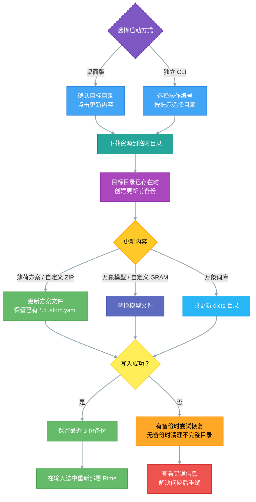

# 导入薄荷拼音
在前面的过程中，你已经了解如何安装Rime输入法了。

实际上，Rime输入法可以配置成任何输入法，比如： 闽南语输入法、吴语输入法、粤语输入法等等；你也可以简单配置一下输入按键的转义，比如：配置输入ABC，实际上是CBA、模糊拼音等。

但是，这一切对于一个新用户来说，可能比较复杂；在探索Rime的配置时候，建议使用他人配置好的模板，比如： 雾凇拼音。当然，也可以用本文的薄荷输入法（薄荷rime输入配置）。

安装的方法有三种：

- **手动覆盖安装配置文件**: 在 rime 客户端下载和安装好的情况下，手动下载薄荷配置文件，将配置文件移动到配置目录内，然后重新部署即可。
- 东风破安装薄荷配置: 适用于大部分的桌面端 rime 客户端，在配置了东风破的情况下，可以直接通过东风破一键导入薄荷配置方案。
- **[使用桌面工具或 CLI](#⭐cli导入和更新薄荷)**：无需安装 Git，通过 Oh My Rime 工具导入和更新薄荷方案、模型与词库。

本章节先介绍手动覆盖安装配置文件的方法，再介绍东风破和桌面工具 / CLI 的用法。

## 下载薄荷输入配置
薄荷输入配置是使用[GPL 3.0](https://github.com/Mintimate/oh-my-rime/blob/main/LICENSE)的开源项目，这意味着你可以看到它的一切源代码，并且自己定制和更改，但是请遵守开源协议，不得用于商用。

我们进入薄荷输入法（rime配置）的项目地址: 
- [薄荷输入配置 Github 地址: https://github.com/Mintimate/oh-my-rime](https://github.com/Mintimate/oh-my-rime)
- [薄荷输入配置 CNB 地址: https://cnb.cool/Mintimate/rime/oh-my-rime](https://cnb.cool/Mintimate/rime/oh-my-rime)

下载薄荷到本地：


::: info 提示信息

如果你在 GitHub 上不知道下载那一个，或者下载过慢；那么可以使用薄荷提供的镜像下载（感谢 [CNB](https://cnb.cool) 提供的算力和存储支持；自动打包薄荷方案）
- [薄荷方案打包下载（ CNB 镜像）](https://cnb.cool/Mintimate/rime/oh-my-rime/-/releases/download/latest/oh-my-rime.zip)

:::

解压后，内部文件应该是这样的：


## 移动配置文件
当我们解压获得薄荷输入配置后，需要将配置文件移动到Rime的配置目录内。

默认的配置文件地址：
- macOS鼠须管: `$HOME/Library/Rime/`
- macOS Fcitx5: `$HOME/.local/share/fcitx5/rime`
- Windows小狼毫: `%APPDATA%/Rime`
- Linux ibus: `$HOME/.config/ibus/rime`
- Linux Fcitx5: `$HOME/.local/share/fcitx5/rime`
- Linux Fcitx5(Flatpak): `$HOME/.var/app/org.fcitx.Fcitx5/data/fcitx5/rime`
- Android Fcitx(小企鹅): `/storage/emulated/0/Android/data/org.fcitx.fcitx5.android/files/data/rime/`

macOS鼠须管和Windows的小狼毫可以通过软件打开配置文件的地址，比如macOS：


而对于Android的Fcitx小企鹅，你可以使用MT文件管理器打开配置文件的地址（你可以试试文件管理器搜索`fcitx.fcitx5`）：


::: info
图里是已经安装好薄荷输入法了，否则左侧的配置文件地址，应该是空文件夹。
:::

在打开配置文件地址后，我们将薄荷输入配置文件移动进入：


## 部署薄荷输入配置
在上述完成后，我们进行rime的部署即可，比如：macOS上的鼠须管


同样，对于Android的Fcitx5小企鹅也有一些特殊，需要在任意一个可以输入的界面操作：


在部署完成后，即可使用薄荷输入配置（薄荷输入法）。

## ⭐东风破导入薄荷
如果你熟悉东风破的操作，可以直接通过东风破导入薄荷输入配置。东风破的前置条件：
- 已经安装好 Git，并且配置到环境变量内；

如果你是Windows用户，其实小狼毫已经自带一个半成品的东风破，你可以在小狼毫的`方案选单设定`中的`获取更多输入方案`内激活东风破：


之后，在这个界面内，输入薄荷的配方：
```text
Mintimate/oh-my-rime:plum/full
```


需要注意，如果你的电脑没有配置Git，那么可能需要先输入`plum`，使其自动配置和下载Git后，激活完整版东风破：


> 参考: [Windows下使用东风破安装异常](https://github.com/Mintimate/oh-my-rime/issues/123)、[Plum Wiki: 安装与更新输入方案](https://github.com/rime/weasel/wiki/%E5%AE%89%E8%A3%85%E4%B8%8E%E6%9B%B4%E6%96%B0%E8%BE%93%E5%85%A5%E6%96%B9%E6%A1%88)

::: info 推荐🥳
这个在CMD窗口上显示系统配置的工具是什么呢？ 可以参考：[摸不透系统当前状态和配置？一条命令快速查看! NeoFetch和FastFetch使用详解](https://www.bilibili.com/video/BV1fHYLeSEr4/)
:::

如果你使用的是macOS或者Linux，你可以通过终端输入东风破的命令：
```bash
# 安装东风破，这将在当前目录下生成(clone)一个plum项目
curl -fsSL https://raw.githubusercontent.com/rime/plum/master/rime-install | bash
# 进入东风破的目录
cd plum
```


在这个目录，输入薄荷的配方：
```bash
# 安装薄荷输入法（方案配置）
./rime-install Mintimate/oh-my-rime:plum/full
```


默认情况：
- macOS自动识别为鼠须管，也就是安装配置方案到`$HOME/Library/Rime/`。
- Linux自动识别为ibus，也就是安装配置方案到`$HOME/.config/ibus/rime`。

如果你的Linux使用Fcitx5，你可以通过`rime_frontend`参数或`rime_dir`指定安装配置文件的目录：
```bash
# 指定安装到Fcitx5的配置目录
rime_frontend=fcitx-rime bash rime-install Mintimate/oh-my-rime:plum/full
# 或者指定安装配置目录
rime_dir="$HOME/.config/fcitx/rime" bash rime-install Mintimate/oh-my-rime:plum/full
# 指定安装到Fcitx5
rime_dir="$HOME/.local/share/fcitx5/rime" bash rime-install Mintimate/oh-my-rime:plum/full
```

参考：
- [rime-plum](https://github.com/rime/plum)

## ⭐桌面工具和 CLI 导入与更新薄荷 {#⭐cli导入和更新薄荷}

[Oh My Rime（OMR）](https://github.com/Mintimate/oh-my-rime-cli) 是薄荷配置管理工具，支持 macOS、Windows 和 Linux，无需安装 Git。虽然仓库仍叫 `oh-my-rime-cli`，现在已经同时提供**桌面图形界面**和**独立 CLI**；不熟悉命令行的用户可以直接使用桌面版。

工具用于管理 Rime 配置，使用前请先[安装对应的 Rime 输入法客户端](./installRime)。从 v4.0.0 起，桌面版采用全新界面，并支持应用自动更新；旧 Go/Wails 版本需要先手动安装一次新版。


以上为项目提供的界面示例，版本号以发布页为准。桌面版支持亮色、跟随系统和暗色模式。

### 下载与安装

请从项目发布页下载，按操作系统和处理器架构选择文件：

- [GitHub Releases](https://github.com/Mintimate/oh-my-rime-cli/releases)
- [CNB 镜像下载](https://cnb.cool/Mintimate/rime/oh-my-rime-cli/-/releases)

| 平台 | 桌面安装包 | 独立 CLI |
| --- | --- | --- |
| macOS Apple Silicon（M 系列） | `Oh-My-Rime_<版本>_macOS_arm64.dmg` | `cli-macos-arm64` |
| macOS Intel | `Oh-My-Rime_<版本>_macOS_x64.dmg` | `cli-macos-x64` |
| Windows x64 | `.msi` 或 `-setup.exe` | `cli-windows-x64.exe` |
| Linux x64 | `.AppImage`、`.deb` 或 `.rpm` | `cli-linux-x64` |

一般选择正式版；标记为 **Pre-release** 的是测试版。`.app.tar.gz`、`.sig` 和 `latest.json` 用于应用自动更新，macOS 手动安装请选择 `.dmg`。

- **macOS**：打开 DMG，将 `Oh My Rime.app` 拖入“应用程序”，再从“应用程序”启动。
- **Windows**：运行 `.msi` 或 `-setup.exe`，按安装向导完成安装后启动。
- **Linux**：根据发行版安装 `.deb` / `.rpm`，或者为 `.AppImage` 添加执行权限后运行。

::: info 首次打开
macOS 安装包目前使用 ad-hoc 签名，尚未通过 Apple 公证。如提示无法验证开发者，确认下载来源后，可在尝试打开应用后前往 **系统设置 → 隐私与安全性 → 仍要打开**，按系统提示确认。详见 [Apple 官方说明](https://support.apple.com/zh-cn/102445)。

Windows 安装包目前未配置代码签名。请认准上述项目发布页并核对下载来源。
:::

### 使用桌面版更新配置

1. 打开“方案更新”页，在右侧“目标目录”中选择正在使用的输入法目录；也可以点击文件夹按钮选择目录，或填写“自定义路径”。
2. 确认目录后，点击所需的更新卡片即可开始任务。第一次安装薄荷时选择“薄荷方案”。自定义资源则先填写下载直链，再点击输入框旁的“更新”。
3. 在“任务进度”中查看状态；遇到问题可打开“运行日志”，查看或复制本次会话日志。
4. 提示更新完成后，在鼠须管、小狼毫、Fcitx5 或 iBus 中**重新部署 Rime**，使配置生效。

| 更新内容 | 作用 |
| --- | --- |
| 薄荷方案 | 下载薄荷方案包并更新配置，保留已有的 `*.custom.yaml` 文件。 |
| 万象模型 | 更新目标目录中的 `wanxiang-lts-zh-hans.gram`。使用模型还需按[语言模型配置](./languageModel)启用。 |
| 万象词库 | 下载薄荷方案包，只更新其中的 `dicts/` 词库目录。 |
| 自定义资源 | 接受 `.zip` 或 `.gram` 下载直链；ZIP 按方案方式更新，GRAM 写入 `wanxiang-lts-zh-hans.gram`。ZIP 内的文件应直接按 Rime 配置目录组织，避免额外套一层文件夹。 |

工具会按平台提供目录预设：macOS 包含鼠须管和小企鹅 Fcitx5，Linux 包含 iBus、Fcitx5 和 Fcitx5 Flatpak。Windows 优先读取小狼毫注册表中的 `RimeUserDir`，读取失败时使用 `%APPDATA%\Rime`。如果安装过多个输入法，请确认选择的是当前使用的配置目录。

::: tip 自定义配置与备份
建议将个人修改写入 [`*.custom.yaml` 覆写文件](./configurationOverride)，直接修改方案自带文件的内容可能在更新时被覆盖。

桌面版和 CLI 都会先将资源下载到临时目录，再备份已有的目标目录并写入更新；写入失败时尝试恢复备份。备份位于目标目录同级的 `<目录名>.backups` 中，例如 `Rime.backups`，更新成功后保留最近 3 份。首次导入且目标目录尚不存在时，不会创建旧配置备份。
:::

### 使用独立 CLI

如果更习惯终端，可以下载表格中的独立 CLI。以下以 macOS Apple Silicon 为例，在终端进入下载文件所在目录后执行：

```bash
# 添加执行权限
chmod +x ./cli-macos-arm64
# 启动交互菜单
./cli-macos-arm64
```

macOS Intel 用户将文件名替换为 `cli-macos-x64`，Linux x64 用户替换为 `cli-linux-x64`。`chmod +x` 是添加执行权限，不需要使用 `sudo` 提权。

Windows 用户可以双击 `cli-windows-x64.exe`，或在文件所在目录打开 PowerShell 后运行：

```powershell
.\cli-windows-x64.exe
```

按提示输入操作编号并回车：

| 输入 | 操作 |
| --- | --- |
| `1` | 更新薄荷方案 |
| `2` | 更新万象模型 |
| `3` | 更新万象词库 |
| `4` | 输入自定义 `.zip` / `.gram` 下载直链 |
| `q` | 退出 |

选择操作后，macOS 和 Linux 会列出目录预设，输入编号选择，直接回车默认选择第 1 项；Windows 使用检测到的小狼毫目录。当前独立 CLI 不提供手动输入目标路径的交互入口，如需自定义目录，请使用桌面版。更新完成后仍需重新部署 Rime。

### 配置更新流程

桌面版和 CLI 共用更新流程；自定义 ZIP 按方案更新，自定义 GRAM 按模型更新。更新配置后，需要在输入法中重新部署：



### 更新工具本身

桌面版启动时会自动检查应用新版本，也可以点击左下角的 **检查应用更新**。发现新版后查看更新说明，再点击 **下载并安装**，应用会验证更新包签名、安装并重启。


截图展示的是当前渠道没有可用更新的状态。

- 正式版默认仅接收正式版；测试版首次运行默认接收测试版，可通过 **接收测试版** 切换，设置会保留。
- 更新 Rime 配置时不能同时安装应用更新。macOS 请从“应用程序”启动，不要在只读 DMG 中执行更新。
- 应用内更新目前从 GitHub 检查和下载；遇到网络问题可稍后重试，或从 CNB 镜像手动下载安装包。
- 旧 Go/Wails 版本需要先手动安装新版；独立 CLI 也需要从发布页手动下载更新。

**应用更新**升级的是 OMR 工具；**方案更新**更新的是 Rime 配置、模型或词库，完成后需要重新部署输入法。

更多说明和源码见 [oh-my-rime-cli 项目](https://github.com/Mintimate/oh-my-rime-cli)（[CNB 镜像](https://cnb.cool/Mintimate/rime/oh-my-rime-cli)）。
