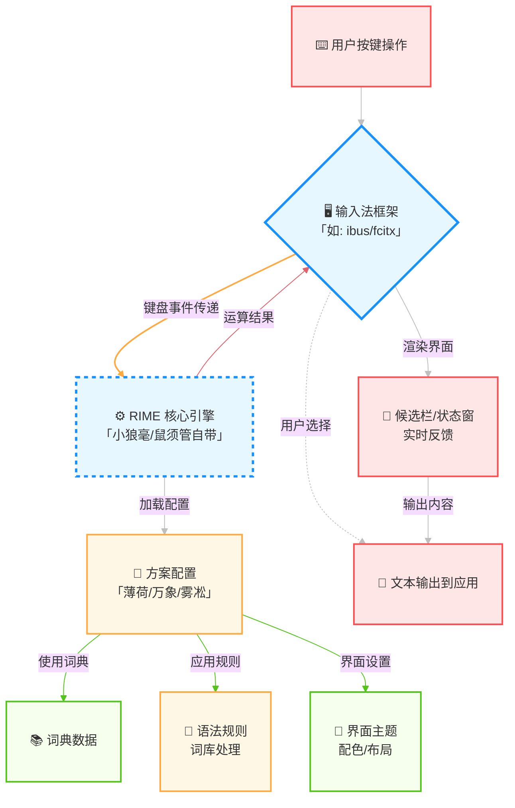

# 配置教程
现在，开始我们的薄荷拼音配置；其实配置的方法很简单，只需要下载并安装当前系统的rime输入法，之后导入薄荷拼音并重新部署即可。

当然，如果先根据自己的喜好进行深度定制，对于新手可能有一些难度；建议在配合本文档的情况下，配合搜索引擎和rime官方文档进行了解。

如果认为本文档或者薄荷拼音对你很有帮助，可以请我喝咖啡:

<donate/>

> 请务必备注『薄荷拼音』或者『oh-my-rime』，对于捐赠咖啡☕️的用户，将进入『[鸣谢](#鸣谢)』内(●'◡'●)ﾉ♥

## 基本概念

薄荷是一个输入方案，RIME 其实是一个算法核心，要组成完整的客户端输入法，还需要一个输入法框架，**三者共同组成一个输入法**。

鼠须管(macOS)和小狼毫(Windows)，可以理解为是输入法框架和 RIME 算法核心的结合体，只需要安装方案，就可以使用； 但是 Android 和 Linux 上的 Fcitx5 是输入法框架，需要安装 RIME 算法核心，才能安装 RIME 的方案，关系如下：

## 推荐教程
这里推荐一些教程，用于辅助深度定制：
- [Rime官方Wiki文档](https://github.com/rime/home/wiki)
- [Rime方案定制指南](https://github.com/LEOYoon-Tsaw/Rime_collections/blob/master/Rime_description.md)
- [雾凇拼音](https://dvel.me/posts/rime-ice/)

## 鸣谢
与此同时，薄荷拼音的配置，离不开网上的丰富教程；薄荷拼音大量借鉴了：
- 雾凇拼音: https://github.com/iDvel/rime-ice

感谢爱发电的支持用户：

| 时间       | 平台     | 用户                                                                      | 支持💵           | 留言                                                                                                |
| ---------- | -------- | ------------------------------------------------------------------------- | --------------- | --------------------------------------------------------------------------------------------------- |
| 2025/06/08 | 微信赞赏 | 微信用户: 东方 | 28¥   | 希望可以导入“王码” |
| 2025/06/06 | 微信赞赏 | 微信用户: 「匿名用户」 | 10¥   | 薄荷输入法 |
| 2025/04/10 | 微信赞赏 | 微信用户: fix u                                                           | 10¥             | 感谢作者开源🙏                                                                                       |
| 2025/01/03 | 微信赞赏 | QQ用户:凌(873**534)                                                       | 5¥              | 感谢在QQ群无私的帮助                                                                                |
| 2025/01/04 | 爱发电   | [爱发电用户_NVKP](https://afdian.com/u/b5636c3aca4d11ef8f5a5254001e7c00)  | 15¥             | oh-my-rime                                                                                          |
| 2024/10/26 | 微信赞赏 | 微信用户: Jacian                                                          | 10¥             | 很好用的方案，希望一直维护下去                                                                      |
| 2024/10/20 | 微信赞赏 | 微信用户: Torjoy                                                          | 20¥             | 感谢大佬                                                                                            |
| 2024/09/27 | 微信赞赏 | RIME输入法交流小群群友                                                    | 10¥             | 叮，你要的奶茶                                                                                      |
| 2024/09/06 | 微信赞赏 | 微信用户: YANGZhitao                                                      | 20¥             | 很好用! 感谢维护这套方案                                                                            |
| 2024/08/21 | 微信赞赏 | 微信用户: ZY                                                              | 20¥             | 谢谢你维护这套方案                                                                                  |
| 2024/06/30 | 爱发电   | [奶茶不加冰](https://afdian.com/u/802ed17a36bf11efa4db52540025c377)       | 20¥             | 手机上已经用上了，体验非常好，感谢作者。                                                            |
| 2024/06/12 | 爱发电   | [爱发电用户_15aca](https://afdian.com/u/15aca804289b11efa13952540025c377) | 36¥             | oh-my-rime                                                                                          |
| 2024/06/11 | 爱发电   | [爱发电用户_9d84b](https://afdian.com/u/9d84b3ac280011efa1d352540025c377) | 20¥             | oh-my-rime, perfect!                                                                                |
| 2024/05/31 | 爱发电   | [爱发电用户_sYNg](https://afdian.com/u/c428e6701f1a11efab4a5254001e7c00)  | 20¥             | 一个月前就准备请up来杯奶茶了~今天是时候兑现一下了！感谢up的薄荷拼音真的非常好用~我已经全平台跟进啦~ |
| 2024/05/28 | 微信     | 公众号用户: 晶码战士                                                      | 50¥             | 薄荷输入法👍👍👍                                                                                       |
| 2024/04/28 | 爱发电   | [爱发电用户_UkCK](https://afdian.com/u/8717bcc8054511efbfc052540025c377)  | 20¥（一杯奶茶） | oh-my-rime                                                                                          |
| 2024/03/15 | 爱发电   | [爱发电用户_520f9](https://afdian.com/u/520f9e12e26111eeaa3a5254001e7c00) | 50¥（KFC）      | 辛苦了，希望能持续更新下去！                                                                        |
| 2024/01/22 | 爱发电   | [爱发电用户_8b769](https://afdian.com/u/8b769b02b8c111ee928952540025c377) | 50¥（KFC）      | Hi, 感谢维护oh-my-rime                                                                              |

## 交流群
如果你有QQ，并且想一起探索和探讨Rime: 
- QQ群: 703260572 (拒绝广告，支持闲聊~)

> 注意: 这是交流群，不是客服群；本身也是开源配置，也不存在售后和客服关系。