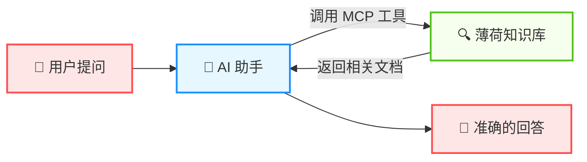
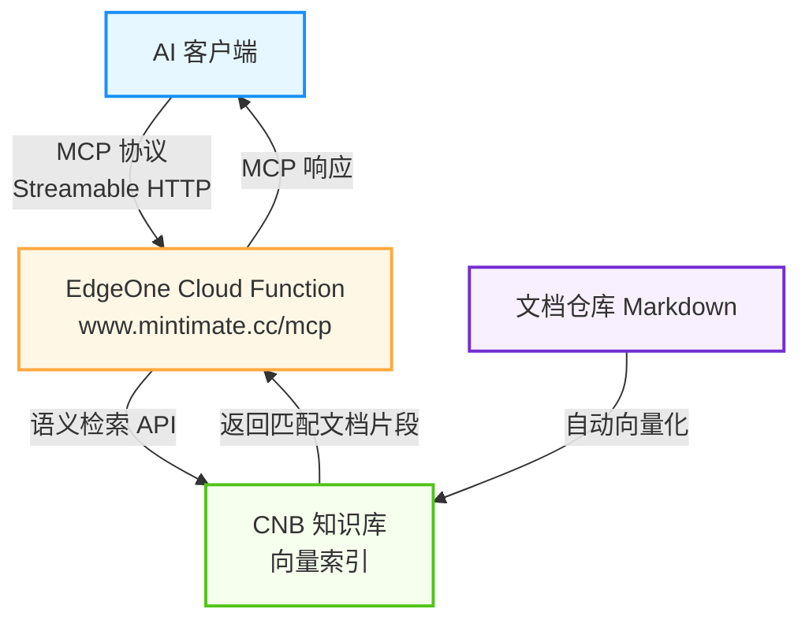

# AI MCP 服务 <Badge type="tip" text="New" />

薄荷输入法提供了基于 [MCP (Model Context Protocol)](https://modelcontextprotocol.io/) 的知识库查询服务。通过 MCP，你可以让 **AI 编辑器**（如 Cursor、Windsurf、VS Code 等）直接访问薄荷输入法的文档知识库，在与 AI 对话时获取准确的配置教程和使用指南。

> 简单来说：配置 MCP 后，你可以直接在 AI 编辑器中问关于薄荷输入法的问题，AI 会自动查询我们的知识库来回答你。

## 什么是 MCP？

MCP（Model Context Protocol，模型上下文协议）是由 Anthropic 提出的一项开放协议，用于标准化 AI 模型与外部数据源和工具之间的交互方式。你可以把它理解为 AI 助手的"插件系统"——通过 MCP，AI 可以调用外部工具来获取实时的、准确的信息，而不是仅仅依赖训练数据。



## 服务信息

| 项目 | 说明 |
|------|------|
| **服务地址** | `https://www.mintimate.cc/mcp` |
| **传输协议** | Streamable HTTP |
| **协议版本** | `2025-03-26` |
| **可用工具** | `query_oh-my-rime` — 语义搜索薄荷输入法知识库 |

## 在 AI 编辑器中配置

### Cursor

在项目根目录创建 `.cursor/mcp.json` 文件，或者在 Cursor 的全局设置中添加：

```json
{
  "mcpServers": {
    "oh-my-rime-knowledge": {
      "url": "https://www.mintimate.cc/mcp",
      "transport": "streamable-http"
    }
  }
}
```

### Windsurf

在 Windsurf 的 MCP 配置文件中添加：

```json
{
  "mcpServers": {
    "oh-my-rime-knowledge": {
      "serverUrl": "https://www.mintimate.cc/mcp",
      "transport": "streamable-http"
    }
  }
}
```

### VS Code（GitHub Copilot）

在项目根目录创建 `.vscode/mcp.json` 文件：

```json
{
  "servers": {
    "oh-my-rime-knowledge": {
      "type": "http",
      "url": "https://www.mintimate.cc/mcp"
    }
  }
}
```

### Claude Desktop

在 Claude Desktop 的配置文件中添加（配置文件路径：macOS 为 `~/Library/Application Support/Claude/claude_desktop_config.json`，Windows 为 `%APPDATA%\Claude\claude_desktop_config.json`）：

```json
{
  "mcpServers": {
    "oh-my-rime-knowledge": {
      "url": "https://www.mintimate.cc/mcp",
      "transport": "streamable-http"
    }
  }
}
```

::: tip 提示
不同的 AI 编辑器/客户端配置格式可能略有差异，请参考对应工具的官方文档。以上配置仅供参考，核心是将 MCP 服务地址 `https://www.mintimate.cc/mcp` 配置到对应的 MCP 设置中。
:::

## 使用方法

配置完成后，你可以在 AI 对话中直接提问关于薄荷输入法的问题，AI 会自动调用 `query_oh-my-rime` 工具来查询知识库。例如：

- *"如何在 macOS 上安装薄荷输入法？"*
- *"薄荷输入法怎么配置模糊拼音？"*
- *"如何开启小鹤双拼方案？"*
- *"Rime 的配置文件覆写是怎么回事？"*

### 工具参数

`query_oh-my-rime` 工具支持以下参数：

| 参数 | 类型 | 必填 | 说明 |
|------|------|------|------|
| `query` | string | ✅ | 自然语言查询，支持中英文。例如：`如何配置薄荷输入法` |
| `keyword` | string | ❌ | 关键词过滤，多个关键词用英文分号分隔。例如：`macOS;安装;Rime` |

::: info 说明
MCP 工具的调用通常由 AI 助手自动完成，你只需要用自然语言提问即可，无需手动传递这些参数。
:::

## 技术实现

本 MCP 服务基于 [EdgeOne Pages Cloud Functions](https://edgeone.ai/) 部署，使用了 CNB 知识库的向量语义检索能力。文档仓库的 Markdown 内容会自动向量化并建立索引，从而支持高精度的语义搜索。

整体架构如下：


